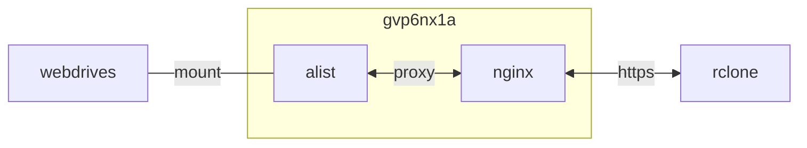

{}
> teambition 트래픽 정책 변경과 보안 이슈가 잦음

teambition -> teldrive 마이그레이션 완료 후 삭제할 것
{}




## container 구성

### docker-compose.yml
```sh
vi /opt/alist/docker-compose.yml
```
```yml
services:
  alist:
    image: xhofe/alist:v3.27.0 #보안 이슈로 롤백 https://singingdalong.blogspot.com/2025/06/Alist-project-issue-8649.html#gsc.tab=0
    container_name: alist
    networks:
      - dev
    ports:
      - 5244:5244/tcp
    user: 0:0
    environment:
      - PUID=1000
      - PGID=1000
      - UMASK=022
      - TZ=Asia/Seoul
    volumes:
      - /opt/alist/config:/opt/alist/data:rw
    restart: unless-stopped
networks:
  dev:
    external: true
```

### config.json
로그 생성 차단
```sh
vi /opt/alist/config/config.json
```
```json
...
  "temp_dir": "data/temp",
  "bleve_dir": "data/bleve",
  "log": {
    "enable": false,
    "name": "data/log/log.log",
    "max_size": 0,
    "max_backups": 0,
    "max_age": 7,
    "compress": false
  },
...
```

### proxy 구성
```sh
vi /opt/nginx/config/conf.d/include/proxy.conf
```
```conf
proxy_http_version 1.1;

# Proxy SSL
proxy_ssl_server_name on;

# Proxy headers
proxy_set_header Host                 $host;
proxy_set_header Upgrade              $http_upgrade;
proxy_set_header Connection           $connection_upgrade;
proxy_set_header X-Real-IP            $remote_addr;
proxy_set_header Forwarded            $proxy_add_forwarded;
proxy_set_header X-Forwarded-For      $proxy_add_x_forwarded_for;
proxy_set_header X-Forwarded-Proto    $scheme;
proxy_set_header X-Forwarded-Protocol $scheme;
proxy_set_header X-Forwarded-Host     $host;
proxy_set_header X-Forwarded-Port     $server_port;
proxy_set_header Connection           "";

# Proxy timeouts
proxy_connect_timeout 180s;
proxy_send_timeout    180s;
proxy_read_timeout    180s;
...
```
```sh
vi /opt/nginx/config/sites-available/alist.conf
```
```conf
...
  include  /etc/nginx/conf.d/include/proxy.conf;
  location / {
    if ($allowed_country = no) {
      return 403;
    }
    proxy_pass http://alist:5244;
  }
  location /dav {
    if ($allowed_country = no) {
      return 403;
    }
    # webdav 공통
    proxy_buffering         off;
    proxy_request_buffering off;
    client_max_body_size    0;
    keepalive_timeout       180s;
    proxy_pass http://alist:5244/dav;
  }
...
```


{}
> WebAV 액세스 객체와 alist가 LAN인 경우 두 모드 간에 속도 차이가 없습니다.<br>
> 에이전트 모드를 선택하는 것이 좋습니다.<br>
> 외부 네트워크인 경우 302 점프는 서버를 우회하여 네트워크 디스크에 직접 액세스할 수 있습니다.<br>
> 속도가 더 빠르고 alist 서버의 대역폭을 차지하지 않습니다.<br>
> 그러나 302 점프는 각 네트워크 디스크에 맞게 요청 헤더를 설정해야 할 수 있습니다.<br>
> 에이전시 모델에는 이러한 우려가 없습니다.<br>
> 또한 302는 여러 IP에 대한 동시 액세스 문제도 있습니다. [^1]

teambition webdav 구성. rclone과 정상 작동 (2015-11)<br>
- 302 redirect
- Use s3 upload method


{}

## Troubleshooting
{}
> "error_code":31326, "error_msg":"anti hotlinking"

baidu 대용량 파일 다운로드 시 오류. User-Agent: pan.baidu.com 변경
{}

{}
> teambition 프리티어 트래픽 정책 변경 (2023-11)

트래픽 허용량이 너무 작아짐
{}

{}
> nginx 405 오류

alist에서 Use s3 upload method 활성화
{}

{}
> nginx 413 오류

nginx에서 client_max_body_size 구성 추가 (webdav 공통)
```sh
vi /opt/nginx/config/sites-available/alist.conf
```
```
...
client_max_body_size    0;
...
```
{}

{}
> AlistGo/alist 프로젝트 이슈 #8649 [^3]

xhofe/alist:v3.27.0 사용 권고
{}

{}
> 보안 취약점: CVE-2024-47067 [^2]<br>
> AList는 여러 저장소를 지원하는 파일 리스트 프로그램입니다.<br>
> AList에는 helper.go에 반영된 크로스 사이트 스크립팅 취약점이 포함되어 있습니다.<br>
> 엔드포인트 /i/:link_name는 사용자가 제공한 값을 받아들여 응답에 반영합니다.<br>
> 엔드포인트는 application/xml 응답을 반환하여 XHTML을 통해 HTML 태그를 사용할 수 있게 하여 XSS 취약점으로 이어집니다.<br>
> 이 취약점은 3.29.0에서 수정되었습니다.

xhofe/alist:v3.29.0 사용 권고
{}

[^1]: https://post.smzdm.com/p/agqo096d/
[^2]: https://www.cvedetails.com/cve/CVE-2024-47067/
[^3]: https://singingdalong.blogspot.com/2025/06/Alist-project-issue-8649.html#gsc.tab=0
