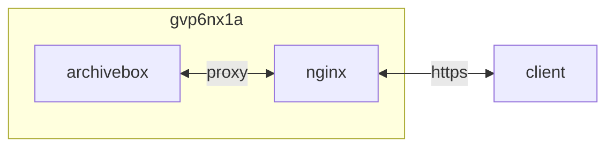

## container 구성

### .env
```sh
vi /opt/archivebox/.env
```
```ini
ADMIN_USERNAME=dev
ADMIN_PASSWORD=k***************************************************************
```

### docker-compose.yml
```sh
vi /opt/archivebox/docker-compose.yml
```
```yml
services:
  archivebox:
    image: archivebox/archivebox:sha-5c1a14e
    container_name: archivebox
    networks:
      - dev
    ports:
      - 8000/tcp
    user: 0:0
    environment:
      - ALLOWED_HOSTS=*
      - MEDIA_MAX_SIZE=750m
      - ADMIN_USERNAME=$ADMIN_USERNAME
      - ADMIN_PASSWORD=$ADMIN_PASSWORD
      - TZ=Asia/Seoul
    volumes:
      - /opt/archivebox/data:/data:rw
    restart: unless-stopped
networks:
  dev:
    external: true
```

### 설치
```sh
cd /opt/archivebox/ && docker compose run archivebox init
```

## host 구성

### logrotate
```sh
sudo vi /etc/logrotate.d/archivebox
```
```
/opt/archivebox/data/logs/*.log {
  daily
  rotate 7
  missingok
  notifempty
  dateext
  dateyesterday
  dateformat -%Y%m%d
  create 0664 999 999
  sharedscripts
  postrotate
    docker restart archivebox >/dev/null 2>&1 || true
  endscript
}
```

## Troubleshooting
{}
> PermissionError: [Errno 13] Permission denied: '/data/logs/errors.log'

container 실행 계정 (999:999) 변경
```sh
sudo sed -Ei "s/create 0664 dev dev/create 0664 999 999/g" /etc/logrotate.d/archivebox && \
sudo logrotate -v /etc/logrotate.d/archivebox && \
docker exec -it nginx nginx -s reload
```
{}

## References
- https://github.com/ArchiveBox/ArchiveBox/wiki/Install
