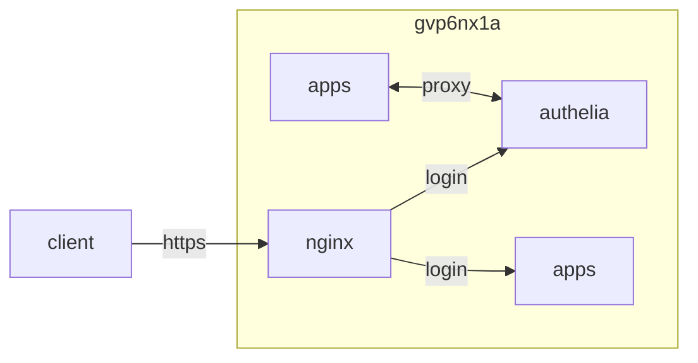

## container 구성

### docker-compose.yml
```sh
vi /opt/authelia/docker-compose.yml
```
```yml
services:
  authelia:
    image: authelia/authelia:latest
    container_name: authelia
    networks:
      - dev
    ports:
      - 9091/tcp
    user: 0:0
    environment:
      - TZ=Asia/Seoul
    volumes:
      - /opt/authelia/config:/config:rw
    restart: unless-stopped
networks:
  dev:
    external: true
```

### configuration.yml
| app          | url                     | admiin 접근 | guest 접근 | login 페이지 |
|--------------|-------------------------|-------------|------------|--------------|
| privatebin   | pb.gvp6nx1a.duckdns.org | O           | X          | X            |
| webtop       | wb.gvp6nx1a.duckdns.org | O           | O          | X            |
| esportshlper | es.gvp6nx1a.duckdns.org | O           | O          | X            |
| g4f          | g4.gvp6nx1a.duckdns.org | O           | O          | X            |
| authelia     | au.gvp6nx1a.duckdns.org | O           | O          | O            |
```sh
vi /opt/authelia/config/configuration.yml
```
```yml
server:
  address: 'tcp://:9091/authelia'
log:
  level: 'info'
identity_validation:
  reset_password:
    jwt_secret: 'p***************************************************************'
default_redirection_url: 'https://au.gvp6nx1a.duckdns.org/'
duo_api:
  hostname: 'gvp6nx1a.duckdns.org'
  integration_key: 'c***************************************************************'
  secret_key: 'b***************************************************************'
authentication_backend:
  password_reset:
    disable: false
  file:
    path: '/config/users_database.yml'
    password:
      algorithm: 'argon2id'
      iterations: 3
      memory: 65536
      parallelism: 4
      key_length: 32
      salt_length: 16
access_control:
  default_policy: 'deny'
  rules:
    - domain_regex: '^(pb).gvp6nx1a.duckdns.org'
      subject: 'group:guests'
      policy: 'one_factor'
    - domain_regex: '^(wb|es|g4).gvp6nx1a.duckdns.org'
      subject: 'group:admins'
      policy: 'one_factor'
    - domain: 'au.gvp6nx1a.duckdns.org'
      policy: 'bypass'
session:
  name: 'authelia_session'
  secret: 'K***************************************************************'
  expiration: '1h'
  inactivity: '5m'
  remember_me: '1M'
  domain: 'gvp6nx1a.duckdns.org'
regulation:
  max_retries: 3
  find_time: '2m'
  ban_time: '5m'
storage:
  encryption_key: 'E***************************************************************'
  local:
    path: '/config/db.sqlite3'
notifier:
  disable_startup_check: false
  smtp:
    host: 'smtp.mail.yahoo.com'
    port: 465
    timeout: '5 seconds'
    username: 'x*******@yahoo.com'
    password: '****************'
    sender: 'Authelia <x*******-********@yahoo.com>'
    identifier: 'localhost'
    subject: '[Authelia] {title}'
    startup_check_address: 'x*******-********@yahoo.com'
    disable_require_tls: false
    disable_html_emails: false
    tls:
      skip_verify: false
      minimum_version: 'TLS1.2'
```

### users_database.yml
암호 hash 생성
```sh
docker run -it --rm authelia/authelia:latest authelia crypto hash generate argon2 --password '***************' && \
docker run -it --rm authelia/authelia:latest authelia crypto hash generate argon2 --password '***************'
```
```
Digest: $argon2id$v=19$m=65536,t=3,p=4*******************************************************************
Digest: $argon2id$v=19$m=65536,t=3,p=4*******************************************************************
```
```sh
vi /opt/authelia/config/users_database.yml
```
```yml
users:
  dev:
    password: '$argon2id$v=19$m=65536,t=3,p=4*******************************************************************'
    displayname: 'dev'
    email: 'x*******-********@yahoo.com'
    groups:
      - 'admins'
      - 'guests'
    disabled: false
  guest:
    password: '$argon2id$v=19$m=65536,t=3,p=4*******************************************************************'
    displayname: 'guest'
    email: ''
    groups:
      - 'guests'
    disabled: false
```

### proxy 구성
```sh
vi /opt/nginx/config/sites-available/authelia.conf
```
```conf
...
  location / {
    if ($allowed_country = no) {
      return 403;
    }
    proxy_pass              http://authelia:9091;
    client_body_buffer_size 128k;
    proxy_next_upstream     error timeout invalid_header http_500 http_502 http_503;
    send_timeout            5m;
    proxy_read_timeout      360;
    proxy_send_timeout      360;
    proxy_connect_timeout   360;
    proxy_set_header        Host              $host;
    proxy_set_header        X-Real-IP         $remote_addr;
    proxy_set_header        X-Forwarded-For   $proxy_add_x_forwarded_for;
    proxy_set_header        X-Forwarded-Proto $scheme;
    proxy_set_header        X-Forwarded-Host  $http_host;
    proxy_set_header        X-Forwarded-Uri   $request_uri;
    proxy_set_header        X-Forwarded-Ssl   on;
    proxy_redirect          http:// $scheme://;
    proxy_http_version      1.1;
    proxy_set_header        Connection        "";
    proxy_cache_bypass      $cookie_session;
    proxy_no_cache          $cookie_session;
    proxy_buffers           64 256k;
    set_real_ip_from        172.18.0.0/24;
    real_ip_header          Forwarded-For;
    real_ip_recursive       on;
  }
...
```
```sh
vi /opt/nginx/config/snippets/authelia-api.conf
```
```conf
internal;
set                      $upstream_authelia http://authelia:9091/api/verify;
proxy_pass_request_body  off;
proxy_pass               $upstream_authelia;
proxy_set_header         Content-Length "";
proxy_next_upstream      error timeout invalid_header http_500 http_502 http_503;
client_body_buffer_size  128k;
proxy_set_header         Host              $host;
proxy_set_header         X-Original-URL    $scheme://$http_host$request_uri;
proxy_set_header         X-Real-IP         $remote_addr;
proxy_set_header         X-Forwarded-For   $remote_addr;
proxy_set_header         X-Forwarded-Proto $scheme;
proxy_set_header         X-Forwarded-Host  $http_host;
proxy_set_header         X-Forwarded-Uri   $request_uri;
proxy_set_header         X-Forwarded-Ssl   on;
proxy_redirect           http:// $scheme://;
proxy_http_version       1.1;
proxy_set_header         Connection "";
proxy_cache_bypass       $cookie_session;
proxy_no_cache           $cookie_session;
proxy_buffers            4 32k;
send_timeout             5m;
proxy_read_timeout       240;
proxy_send_timeout       240;
proxy_connect_timeout    240;
```
```sh
vi /opt/nginx/config/snippets/authelia-auth.conf
```
```conf
auth_request            /authelia;
auth_request_set        $target_url https://$http_host$request_uri;
auth_request_set        $user       $upstream_http_remote_user;
auth_request_set        $email      $upstream_http_remote_email;
auth_request_set        $groups     $upstream_http_remote_groups;
proxy_set_header        Remote-User   $user;
proxy_set_header        Remote-Email  $email;
proxy_set_header        Remote-Groups $groups;
error_page              401 =302 https://au.gvp6nx1a.duckdns.org/?rd=$target_url;
client_body_buffer_size 128k;
proxy_next_upstream     error timeout invalid_header http_500 http_502 http_503;
send_timeout            5m;
proxy_read_timeout      360;
proxy_send_timeout      360;
proxy_connect_timeout   360;
proxy_set_header        Host              $host;
proxy_set_header        Upgrade           $http_upgrade;
proxy_set_header        Connection        upgrade;
proxy_set_header        Accept-Encoding   gzip;
proxy_set_header        X-Real-IP         $remote_addr;
proxy_set_header        X-Forwarded-For   $proxy_add_x_forwarded_for;
proxy_set_header        X-Forwarded-Proto $scheme;
proxy_set_header        X-Forwarded-Host  $http_host;
proxy_set_header        X-Forwarded-Uri   $request_uri;
proxy_set_header        X-Forwarded-Ssl   on;
proxy_redirect          http:// $scheme://;
proxy_http_version      1.1;
proxy_set_header        Connection        "";
proxy_cache_bypass      $cookie_session;
proxy_no_cache          $cookie_session;
proxy_buffers           64 256k;
set_real_ip_from        10.0.0.0/8;
set_real_ip_from        172.0.0.0/8;
set_real_ip_from        192.168.0.0/16;
set_real_ip_from        fc00::/7;
real_ip_header          Forwarded-For;
real_ip_recursive       on;
```
