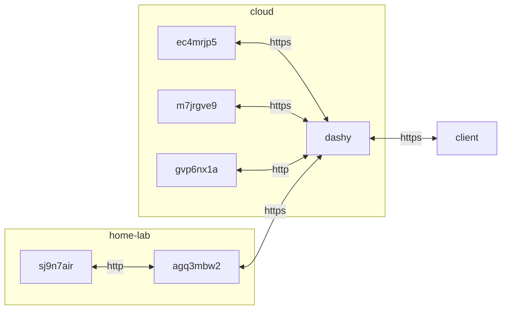

## container 구성

### docker-compose.yml
```sh
vi /opt/dashy/docker-compose.yml
```
```yml
services:
  dashy:
    image: lissy93/dashy:latest
    container_name: dashy
    networks:
      - dev
    ports:
      - 8080/tcp
    user: 0:0
    environment:
      - UID=1000
      - GID=1000
      - MODE_ENV=production
      - TZ=Asia/Seoul
    volumes:
      - /opt/dashy/config/conf.yml:/app/user-data/conf.yml:rw
      - /opt/dashy/item-icons:/app/user-data/item-icons:rw
    restart: unless-stopped
networks:
  dev:
    external: true
```

### 암호 구성
로그인 암호 sha256 hash 생성 후 구성에 저장
```sh
echo -n "2***************************************************************" | sha256sum
```
```
7***************************************************************
```
```sh
vi /opt/dashy/config/conf.yml
```
```
appConfig:
  auth:
    users:
      - user: dev
        hash: 7***************************************************************
        type: admin
...
```

## 데모 페이지


[바로 가기](https://da.gvp6nx1a.duckdns.org)

## Troubleshooting
{}
> Browserslist: caniuse-lite is outdated. Please run:
>   npx update-browserslist-db@latest

 ```sh
docker exec -it dashy npx update-browserslist-db@latest
```
{}
