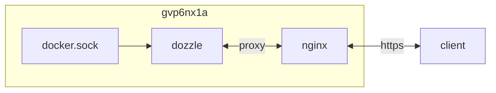

## container 구성

### docker-compose.yml
```sh
vi /opt/dozzle/docker-compose.yml
```
```yml
services:
  dozzle:
    image: amir20/dozzle:latest
    container_name: dozzle
    networks:
      - dev
    ports:
      - 8080/tcp
    user: 0:0
    environment:
      - DOZZLE_AUTH_PROVIDER=simple
      - TZ=Asia/Seoul
    volumes:
      - /var/run/docker.sock:/var/run/docker.sock:ro
      - /opt/dozzle/config:/data:rw
    command:
      - --filter=
      - --level=INFO
      - --no-analytics
    restart: unless-stopped
networks:
  dev:
    external: true
```

### users.yml
암호 구성 yml 생성
```sh
docker run --rm amir20/dozzle generate dev --password 1*************************************************************** > /opt/dozzle/config/users.yml && \
cat /opt/dozzle/config/users.yml && \
cd /opt/dozzle && docker compose rm -f -s && docker compose up -d
```
