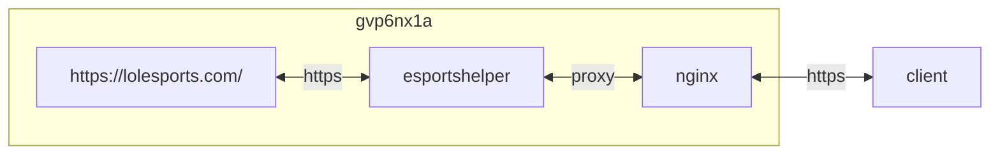

{}
> lolesports.com 로그인 페이지 변경에 대응하지 못함
> 

지원 종료. 2024-02 이후 업데이트 없음 [^1]
{}




## container 구성

### docker-compose.yml
```sh
vi /opt/esportshelper/docker-compose.yml
```
```yml
services:
  esportshelper:
    image: e7hnr8ov/esportshelper:alpine
    container_name: esportshelper
    networks:
      - dev
    ports:
      - 3000/tcp
    user: 0:0
    environment:
      - TZ=Asia/Seoul
      - PUID=1000
      - PGID=1000
    volumes:
      - /opt/esportshelper/config:/config:rw
      - /opt/esportshelper/config.yaml:/esportshelper/config.yaml:rw
      - /opt/esportshelper/data:/esportshelper/dropsHistory:rw
    shm_size: 2gb
    restart: unless-stopped
networks:
  dev:
    external: true
```
```sh
sudo docker cp esportshelper:/esportshelper/config.yaml /opt/esportshelper/ && \
sudo chown dev:dev -R /opt/esportshelper
```

### config.yaml
```sh
vi /opt/esportshelper/config.yaml
```
```yml
### 필수 입력 사항
username: "f*******"                 # 필수, 계정 번호
password: "o***********************" # 필수, 비밀번호
### 선택사항
delay: 600            # 각 검사의 시간 간격(초)(기본값은 600초)(각 감지 시간은 설정한 지연의 0.8-1.5배 사이에서 무작위로 변동됩니다)
headless: False       # True로 설정하면 프로그램이 백그라운드에서 실행되고, 그렇지 않으면 브라우저 창이 열립니다(기본값은 False).
language: "en_US"     # 이제 "zh_CN", "zh_TW", "en_US" 언어를 지원합니다. 중국어 간체, 중국어 번체 및 영어.
nickName: ""          # 닉네임, 비어 있으면 기본값은 사용자 이름입니다(개인 정보 보호 강화).
onlyWatchMatches: ["lcs","lla","lpl","lck","ljl-japan","lco","lec","cblol-brazil","pcs","tft_esports","worlds" ,"wqs"]                 # 감시 전용 경쟁 영역 이름, 소문자.
disWatchMatches: ["prime","lfl","liga","hitpoint","series","nlc","nationals","academy","qualifiers","legends","challengers","league" ] # 대회지역 이름을 보고 싶지 않다면 여기에 추가하면 됩니다. (참고로 소문자입니다.)
maxRunHours: -1       # 음수 값은 항상 실행됨을 의미하고 양수 값은 실행 시간을 의미하며 기본값은 -1입니다.
maxStream: 4          # 기본값은 동시에 시청할 수 있는 최대 게임 수인 4이며, 그 수를 초과하면 시청하지 않습니다.
mode: "safe"          # 모드 선택, safe는 안전 모드, Normal은 일반 모드, 기본값은 safe를 참조하세요.
exportDrops: True     # 기본값은 False입니다. 경력 드롭 세부 정보 파일을 내보내야 하는지 여부는 스크립트가 열릴 때만 생성됩니다.
briefLogLength: 10    #간단한 로그 정보 개수 기본값은 10입니다.
proxy: ""             # 프록시 주소, 선택사항, 일반 사용자는 자신이 무엇을 하고 있는지 알지 못하는 한 입력할 필요가 없습니다.  예: "양말://127.0.0.1:20173"
connectorDropsUrl: "https://discord.com/api/webhooks/1******************/t***************-*****************-*********************************" # (DingTalk, Discord, Job Warning, Enterprise WeChat, Feishu 지원) 구체적인 구성 방법은 여기에 있습니다 https://github.com/Yudaotor/EsportsHelper/wiki/%E6%80% 8E%E4 %B9%88%E9%85%8D%E7%BD%AE%E6%8E%89%E8%90%BD%E6%8F%90%E9%86%92%3F
platForm: "linux"     #플랫폼을 사용하세요. 기본값은 Windows입니다. Linux를 사용해야 하는 경우 여기에서 구성하세요.
closeStream: False    # 스트림 저장 모드, 기본값은 False, 라이브 방송실의 비디오 스트림을 닫습니다(위험이 존재하며 Riot에서 감지할 수 있음).
desktopNotify: False  # 시스템 오른쪽 하단에 팝업 메시지가 표시됩니다. 기본값은 False입니다.
sleepPeriod: ["0-0"]  # 수면 기간, (기본값은 비어 있음) 형식은 "시작 시간 - 종료 시간"입니다. 수면 기간 동안에는 보기 웹페이지가 닫히고 이후에는 잠이 다시 열렸습니다. 간격은 왼쪽이 닫혀 있고 오른쪽이 열려 있습니다.
ignoreBroadCast: True # 생방송 방에 미리 입장하려면 False로 설정하고, 항상 방송되는 특정 경쟁 지역(예: TFT)에서 생방송을 지원합니다.
userDataDir: ""       # xxxxx가 자신의 컴퓨터 이름으로 변경되는 예는 https를 참조하세요. //github.com/Yudaotor/EsportsHelper/wiki/%E6%80%8E%E4%B9%88%E4%BD%BF%E7%94%A8%E6%9C%AC%E5%9C%B0%E6 %B5%8F %E8%A7%88%E5%99%A8%E7%BC%93%E5%AD%98-%E5%85%8D%E8%B4%A6%E5%AF%86%E7% 99%BB% E5%BD%95
chromePath: ""        # Google Chrome 사용자 정의 경로
countDrops: True      # 드롭 수를 확인할지 여부
notifyType: "all"     # 푸시 정보 유형을 필터링합니다. "all"은 모든 정보를 푸시하고, "error"는 오류 정보만 푸시하고, "drops"는 드롭 정보만 푸시합니다.
autoSleep: True       # (권장) 자동으로 잠자기 여부, 기본값은 True
debug: False          # 디버그 모드를 활성화할지 여부. 활성화된 후 예외가 발생하면 스크린샷이 사진 폴더로 이동됩니다. 기본값은 False입니다.
arm64: True           # Linux ARM64에서 Chromium 사용을 지원하려면 platformForm: "linux"를 구성하고 "/home/USERNAME/.local/share/unDetected_chromedriver/chromedriver" 경로에 chromedriver가 있어야 합니다. 자세한 내용은 다음을 참조하세요. https:/ /github.com/Yudaotor/EsportsHelper/wiki/The-Way-Using-Chromium-on-ARM64
isDockerized: True    # Docker에서 실행할 때만 True로 구성되며 기본값은 False입니다.
```

### webhook 구성
디스코드 webhook
```sh
export WEBHOOK_URL="https://discord.com/api/webhooks/1******************/t***************-*****************-*********************************"
curl \
  -H "Content-Type: application/json" \
  -d "{\"username\": \"test\", \"content\": \"Test Sender\n$(hostname)\"}" \
  $WEBHOOK_URL
```

### proxy 구성
[authelia](https://hu.gvp6nx1a.duckdns.org/apps/authelia/#proxy-%EA%B5%AC%EC%84%B1) 구성
```sh
vi /opt/nginx/config/sites-available/esportshelper.conf
```
```
...
  location /authelia {
    if ($allowed_country = no) {
      return 403;
    }
    include /etc/nginx/snippets/authelia-api.conf;
  }
  location / {
    if ($allowed_country = no) {
      return 403;
    }
    proxy_pass              http://esportshelper:3000;
    include                 /etc/nginx/snippets/authelia-auth.conf;
    add_header              'Cross-Origin-Embedder-Policy' 'require-corp';
    add_header              'Cross-Origin-Opener-Policy'   'same-origin';
    add_header              'Cross-Origin-Resource-Policy' 'same-site';
    proxy_buffering         off;
    proxy_request_buffering off;
  }
...
```

## Troubleshooting
{}
> docker restart 불가

```sh
docker exec -it esportshelper rm -rf /tmp/.X1-lock && docker restart esportshelper
```
{}

{}
> ERROR: failed to solve: ghcr.io/linuxserver/baseimage-kasmvnc:alpine318: failed to resolve source metadata for ghcr.io/linuxserver/baseimage-kasmvnc:alpine318: no match for platform in manifest: not found

기존 Dockerfile로 build 불가. baseimiage 변경 필요
{}

[^1]: https://github.com/Yudaotor/EsportsHelper
