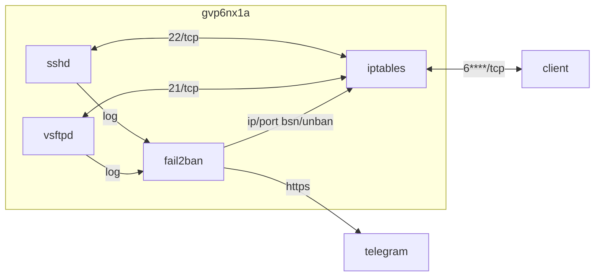

## host 구성

### 설치
```sh
sudo dnf -y update && sudo dnf install -y fail2ban whois
```

### jail.local
```sh
sudo vi /etc/fail2ban/jail.local
```
```ini
[INCLUDES]
before = paths-fedora.conf

[DEFAULT]
ignoreip      = 192.168.192.1 2**.**.**.* 1**.***.**.* 1**.***.**.** 1**.***.**.**
ignorecommand =
bantime       = 1h
findtime      = 1h
maxretry      = 3
maxmatches    = %(maxretry)s
backend       = auto
usedns        = warn
logencoding   = auto
enabled       = false
mode          = normal
filter        = %(__name__)s[mode=%(mode)s]
blocktype     = DROP

destemail            = x*******-********@yahoo.com
sender               = x*******-********@yahoo.com
mta                  = sendmail
protocol             = tcp
chain                = <known/chain>
port                 = 0:65535
fail2ban_agent       = Fail2Ban/%(fail2ban_version)s
banaction            = iptables-multiport
banaction_allports   = iptables-allports
action               = %(action_local)s
action_              = %(banaction)s[port="%(port)s", protocol="%(protocol)s", chain="%(chain)s"]
action_mw            = %(action_)s
                       %(mta)s-whois[sender="%(sender)s", dest="%(destemail)s", protocol="%(protocol)s", chain="%(chain)s"]
action_mwl           = %(action_)s
                       %(mta)s-whois-lines[sender="%(sender)s", dest="%(destemail)s", logpath="%(logpath)s", chain="%(chain)s"]
action_xarf          = %(action_)s
                       xarf-login-attack[service =%(__name__)s, sender="%(sender)s", logpath="%(logpath)s", port="%(port)s"]
action_cf_mwl        = cloudflare[cfuser="%(cfemail)s", cftoken="%(cfapikey)s"]
                       %(mta)s-whois-lines[sender="%(sender)s", dest="%(destemail)s", logpath="%(logpath)s", chain="%(chain)s"]
action_blocklist_de  = blocklist_de[email="%(sender)s", service="%(__name__)s", apikey="%(blocklist_de_apikey)s", agent="%(fail2ban_agent)s"]
action_abuseipdb     = abuseipdb
action_local         = iptables-multiport[chain="%(chain)s", protocol="%(protocol)s", port="%(port)s", blocktype="%(blocktype)s"]
                       telegram
```

### telegram.local
```sh
sudo vi /etc/fail2ban/action.d/telegram.local
```
```ini
[Definition]
actionstart =
actionstop  =
actioncheck =
actionban   = /home/dev/.local/bin/notify_fail2ban.sh actionban <name> <ip>
actionunban = /home/dev/.local/bin/notify_fail2ban.sh actionunban <name> <ip>
```

### 11-sshd.local
```sh
sudo vi /etc/fail2ban/jail.d/11-sshd.local
```
```ini
[sshd]
filter   = sshd[mode=aggressive]
logpath  = %(syslog_authpriv)s
action   = %(action_local)s
chain    = INPUT
protocol = tcp
port     = 22
maxretry = 1
enabled  = true
```

### 12-vsftpd.local
```sh
sudo vi /etc/fail2ban/jail.d/12-vsftpd.local
```
```ini
[vsftpd]
filter   = vsftpd
logpath  = %(vsftpd_log)s
action   = %(action_local)s
chain    = INPUT
protocol = tcp
port     = 21,6****:6****
maxretry = 1
enabled  = true
```

### 구성 적용
```sh
sudo fail2ban-server restart && \
sudo fail2ban-client restart && \
sudo systemctl restart fail2ban && sudo systemctl status fail2ban && \
sudo systemctl list-units --type service
```
```sh
sudo fail2ban-client status sshd;
sudo fail2ban-client status vsftpd
```

### logrotate
```sh
sudo vi /etc/logrotate.d/fail2ban
```
```
/var/log/fail2ban.log {
  daily
  rotate 7
  missingok
  notifempty
  dateext
  dateyesterday
  dateformat -%Y%m%d
  sharedscripts
  postrotate
    /usr/bin/fail2ban-client flushlogs >/dev/null || true
  endscript
}
```

### 밴 등록/취소 [^1]
```sh
sudo fail2ban-client set sshd banip 1.1.1.1;
sudo fail2ban-client set sshd unbanip 1.1.1.1;
sudo fail2ban-client set vsftpd banip 1.1.1.1;
sudo fail2ban-client set vsftpd unbanip 1.1.1.1
```

```sh
vi /home/dev/.local/bin/notify_fail2ban.sh
```
```sh
#!/bin/sh
# fail2ban 알림

. /home/dev/.bashrc
. /home/dev/.local/bin/utils.sh
log_file=/home/dev/.local/log/$(basename "$0" | sed 's/.sh//').log
msg_file=/home/dev/.local/log/$(basename "$0" | sed 's/.sh//').tmp

action="$1"
name="$2"
ip="$3"
{ if [ "$action" = "actionstart" ]; then
    echo  ["$name"] started
  fi
  if [ "$action" = "actionstop" ]; then
    echo  ["$name"] stopped
  fi
  if [ "$action" = "actionban" ]; then
    echo  ["$name"] Ban "$ip"
    whois "$ip" | grep -iE "^(address|country)" \
      | sed -E 's/^(country|address)(.*:)( +)(.*)/\1: \4/gI'
  fi
  if [ "$action" = "actionunban" ]; then
    echo  ["$name"] Unban "$ip"
  fi
} > "$log_file"
cp "$log_file" "$msg_file"
send_tel_msg "$TEL_BOT_KEY" "$TEL_CHAT_ID" "$msg_file"
rm "$msg_file"
```


## Troubleshooting
{}
> fail2ban action firewallcmd 발생 시 firewalld에서 docker chain 사라짐

fail2ban의 action_local 방식 변경 (jail.local): firewallcmd-multiport -> iptables-multiport<br>
{}

[^1]: https://github.com/dntco43u/s6h7k8rv/blob/main/notify_fail2ban.sh
