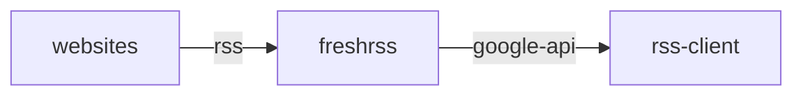

## container 구성

### docker-compose.yml
```sh
vi /opt/freshrss/docker-compose.yml
```
```yml
services:
  freshrss:
    image: linuxserver/freshrss:latest
    container_name: freshrss
    networks:
      - dev
    ports:
      - 80/tcp
    user: 0:0
    environment:
      - PUID=911
      - PGID=911
      - TZ=Asia/Seoul
    volumes:
      - /opt/freshrss/data:/config:rw
      - /opt/freshrss/config/logrotate_nginx.conf:/etc/logrotate.d/nginx:ro
      - /opt/freshrss/config/logrotate_php-fpm.conf:/etc/logrotate.d/php-fpm:ro
    restart: unless-stopped
networks:
  dev:
    external: true
```

### 구성
proxy url 구성
```sh
vi /opt/freshrss/data/www/freshrss/data/config.php
```
```php
<?php
return array (
...
  'base_url' => 'https://fr.m7jrgve9.duckdns.org',
...
```

### logrotate
logrotate는 root(0:0) 권한이 필요하고 app은 abc(911:911)가 실행한다<br>
logrotate 재구성을 위해 host에 mount
```sh
docker exec -it freshrss id 911 && \
sudo docker cp freshrss:/etc/logrotate.d/nginx /opt/freshrss/logrotate/logrotate_nginx.conf && \
sudo docker cp freshrss:/etc/logrotate.d/php-fpm /opt/freshrss/logrotate/logrotate_php-fpm.conf
```
```
uid=911(abc) gid=911(abc) groups=911(abc),1000(users)
```
```sh
sudo vi /opt/freshrss/config/logrotate_nginx.conf
```
```
/config/log/nginx/*.log {
  daily
  rotate 7
  missingok
  notifempty
  dateext
  dateyesterday
  dateformat -%Y%m%d
  sharedscripts
  postrotate
    s6-svc -r /run/service/svc-nginx
  endscript
  su abc abc
  nocompress
}
```
```sh
sudo vi /opt/freshrss/config/logrotate_php-fpm.conf
```
```
/config/log/php/*.log {
  daily
  rotate 7
  missingok
  notifempty
  dateext
  dateyesterday
  dateformat -%Y%m%d
  sharedscripts
  postrotate
    s6-svc -r /run/service/svc-php-fpm
  endscript
  su abc abc
  nocompress
}
```
```sh
docker exec -it freshrss logrotate -v /etc/logrotate.d/nginx && \
docker exec -it freshrss logrotate -v /etc/logrotate.d/php-fpm
```

## windows 구성

### fluent-reader


## Troubleshooting
{}
> error: Ignoring nginx because the file owner is wrong (should be root or user with uid 0).<br>
> error: Ignoring php-fpm because the file owner is wrong (should be root or user with uid 0).

```sh
sudo chown 0:0 /opt/freshrss/config/logrotate_nginx.conf && \
sudo chown 0:0 /opt/freshrss/config/logrotate_php-fpm.conf
```
{}
{}
> 기타 권한 오류
```sh
sudo chown 911:911 -R /home/opc/docker/freshrss/config
```
{}
