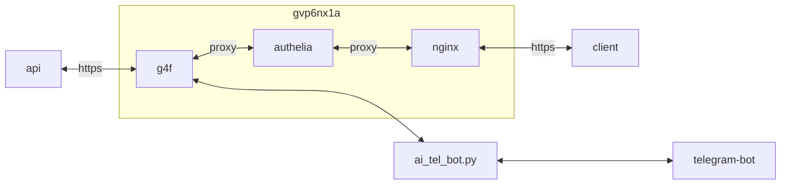

## container 구성

### docker-compose.yml (arm)
```sh
vi /opt/g4f/docker-compose.yml
```
```yml
services:
  g4f:
    image: hlohaus789/g4f:latest-armv7
    container_name: g4f
    networks:
      - dev
    ports:
      - 8080/tcp
      - 1337:1337/tcp
      - 7900/tcp
    user: 0:0
    environment:
      - TZ=Asia/Seoul
    volumes:
      - /opt/g4f/har_and_cookies:/app/har_and_cookies:rw
      - /opt/g4f/generated_images:/app/generated_images:rw
    shm_size: 2gb
    restart: unless-stopped
networks:
  dev:
    external: true
```

### proxy 구성
[authelia](https://hu.gvp6nx1a.duckdns.org/apps/authelia/#proxy-%EA%B5%AC%EC%84%B1) 구성
```sh
vi /opt/nginx/config/sites-available/g4f.conf
```
```
...
  location /authelia {
    if ($allowed_country = no) {
      return 403;
    }
    include /etc/nginx/snippets/authelia-api.conf;
  }
  location / {
    if ($allowed_country = no) {
      return 403;
    }
    proxy_pass http://g4f:8080;
    include    /etc/nginx/snippets/authelia-auth.conf;
    add_header 'Cross-Origin-Embedder-Policy' 'require-corp';
    add_header 'Cross-Origin-Opener-Policy'   'same-origin';
    add_header 'Cross-Origin-Resource-Policy' 'same-site';
  }
...
```

## Troubleshooting
{}
> Could not open lock file /var/lib/dpkg/lock-frontend - open (13: Permission denied)

특성상 이런저런 모듈 설치가 잦다. 실행 권한 1000:1000에서 0:0으로 변경
{}

## References
- https://g4f.dev/docs/config.html
