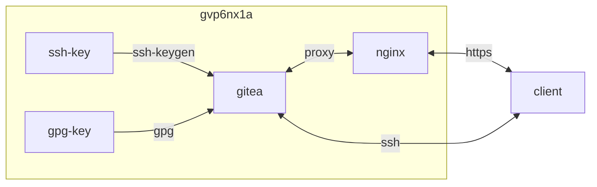

## container 구성

### docker-compose.yml
```sh
vi /opt/gitea/docker-compose.yml
```
```yml
services:
  gitea:
    image: gitea/gitea:latest
    container_name: gitea
    networks:
      - dev
    ports:
      - 61257:22/tcp
      - 3000/tcp
    user: 0:0
    environment:
      - USER_UID=1000
      - USER_GID=1000
    volumes:
      - /opt/gitea/data:/data:rw
      - /etc/timezone:/etc/timezone:ro
      - /etc/localtime:/etc/localtime:ro
    restart: unless-stopped
networks:
  dev:
    external: true
```

### key
gitea 전용의 ssh와 gpg키를 github 구성과 동일하게 생성


- [ssh 구성 바로 가기](https://hu.gvp6nx1a.duckdns.org/infra/github/#ssh)<br>
- [gpg 구성 바로 가기](https://hu.gvp6nx1a.duckdns.org/infra/github/#gpg)<br>

```sh
eval "$(ssh-agent -s)" && \
ssh-add ~/.ssh/git@gvp6nx1a.pem && \
ssh -vT ssh://git@localhost:6**** && \
ssh -p 6**** -i "/home/dev/.ssh/git@gvp6nx1a.pem" git@localhost
```
```
Hi there, dev! You've successfully authenticated with the key named gitea-eddsa-key-20240625, but Gitea does not provide shell access.
```

### app.ini
```sh
vi /opt/gitea/data/gitea/conf/app.ini
```
```
[server]
APP_DATA_PATH = /data/gitea
DOMAIN = localhost
SSH_DOMAIN = gvp6nx1a.duckdns.org
HTTP_PORT = 3000
ROOT_URL = https://gi.gvp6nx1a.duckdns.org
DISABLE_SSH = false
SSH_PORT = 6****
SSH_LISTEN_PORT = 6****
LFS_START_SERVER = true
LFS_JWT_SECRET = S******************************************
OFFLINE_MODE = false

...
[security]
...
REVERSE_PROXY_LIMIT = 1
REVERSE_PROXY_TRUSTED_PROXIES = *
...
```
| Options             | Remarks                                         |
|---------------------|-------------------------------------------------|
| SSH_LISTEN_PORT     | Port for the built-in SSH server                |
| SSH_PORT            | SSH port displayed in clone URL (endpoint 주소) |
| REVERSE_PROXY_LIMIT | proxy에서 real ip 노출 여부                     |

## References
- https://docs.gitea.com/administration/config-cheat-sheet
