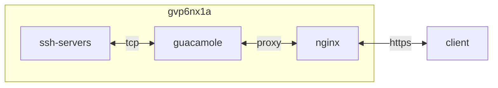

## container 구성

### docker-compose.yml
```sh
vi /opt/guacamole/docker-compose.yml
```
```yml
services:
  guacamole:
    image: flcontainers/guacamole:latest
    container_name: guacamole
    networks:
      - dev
    ports:
      - 8080/tcp
    user: 0:0
    environment:
      - TZ=Asia/Seoul
      - EXTENSIONS=auth-totp
    volumes:
      - /opt/guacamole/config:/config:rw
      - /etc/localtime:/etc/localtime:ro
    restart: unless-stopped
networks:
  dev:
    external: true
```

### proxy 구성
```sh
vi /opt/nginx/config/sites-available/guacamole.conf
```
```
...
  location / {
    if ($allowed_country = no) {
      return 403;
    }
    include                 /etc/nginx/conf.d/include/proxy.conf;
    proxy_pass              http://guacamole:8080;
    proxy_buffering         off;
    proxy_request_buffering off;
  }
...
```

## Troubleshooting
{}
> 초기 계정

guacadmin/guacadmin
{}
