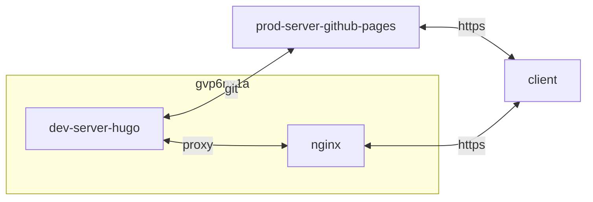

## container 구성

### docker-compose.yml
- 배포 폴더 `/opt/hugo/data/public/`
- 개발 서버이며 여기서 편집 후 운영 적용
- 서버 시작 시 배포 폴더 초기화
- 실시간 새로고침
- baseURL 옵션은 운영 서버 URL 적용 (`sitemap.xml` 생성에 관여)
- environment 옵션 production만 googleanalytics 적용

```sh
vi /opt/hugo/docker-compose.yml
```
```yml
services:
  hugo:
    image: hugomods/hugo:exts
    container_name: hugo
    networks:
      - dev
    ports:
      - 1313/tcp
    user: 1000:1000
    volumes:
      - /etc/timezone:/etc/timezone:ro
      - /etc/localtime:/etc/localtime:ro
      - /opt/hugo/data:/src:rw
    command: hugo server --cleanDestinationDir --poll 700ms --disableFastRender --noHTTPCache --environment production --minify --baseURL https://dntco43u.github.io --appendPort=false
    restart: unless-stopped
networks:
  dev:
    external: true
```

### docsy 테마 [^2]
- 템플릿은 exts 모듈이 적용된 [docsy-example](https://github.com/google/docsy-example) 테마
- 폴더 구조 변경. 기존 구조가 2-depth(`/content/blog/`)인데 1-depth(`/content/`)로 바꾸고 blog로만 사용
- `/content/search.md`는 삭제. 1-depth 구조에서 노출을 막으려면 이것저것 수정해야 하므로
- 이미지 중앙 정렬 스타일 추가 [^4]

```sh
sudo rm -rf /opt/hugo/data && \
docker run --rm -it \
-p1313/tcp \
-v /opt/hugo/data:/src:rw \
hugomods/hugo:exts \
/bin/sh
```

```sh
hugo mod graph && \
cd / && git clone --depth 1 https://github.com/google/docsy-example.git src && \
npm install && \
hugo server
(Ctrl+C)
exit
sudo chown dev:dev -R /opt/hugo/data/ && \
rm /opt/hugo/data/LICENSE && \
rm /opt/hugo/data/*.md && \
rm /opt/hugo/data/{Dockerfile,docker-compose.yaml} && \
find /opt/hugo/data/ -name ".git*" -exec rm -rf {} \;
```

```sh
vi /opt/hugo/data/hugo.yaml
```
```yml
...
module:
  hugoVersion:
    extended: true
    min: 0.146.0
  imports:
    - path: github.com/google/docsy
      disable: false
...
```
```sh
vi /opt/hugo/data/assets/scss/_styles_project.scss
```
```css
...
img[src$='#center'] {
  display: block;
  margin: 1.0rem auto;
  max-width: 100%;
  height: auto;
}
```

### giscus 댓글 [^3]
- 테마 템플릿의 구성이 구 버전이라면 새 버전에 맞게 폴더 구조 변경 `/layouts/partials/` -> `/layouts/_partials/` [^1]<br>
- 댓글을 비활성화하고 싶다면 markdown 파라미터에 no_comment: true 추가
```sh
mv /opt/hugo/data/layouts/partials /opt/hugo/data/layouts/_partials && \
vi /opt/hugo/data/layouts/_partials/disqus-comment.html
```
```html
{{ if not .Params.no_comment }}
<style type="text/css">
  .giscus, .giscus-frame { width: 90%; }
  .container-fluid { height: auto; }
</style>
<div class="page-blank">
  <div class="giscus"></div>
  <script src="https://giscus.app/client.js"
  data-repo="{{site.Params.comments.giscus.repo}}"
  data-repo-id="{{site.Params.comments.giscus.repo_id}}"
  data-category="{{site.Params.comments.giscus.category}}"
  data-category-id="{{site.Params.comments.giscus.category_id}}"
  data-mapping="{{site.Params.comments.giscus.mapping}}"
  data-strict="{{site.Params.comments.giscus.reactions_enabled}}"
  data-reactions-enabled="{{site.Params.comments.giscus.reactions_enabled}}"
  data-emit-metadata="0"
  data-input-position="{{site.Params.comments.giscus.data_input_position}}"
  data-theme="{{site.Params.comments.giscus.theme}}"
  data-lang="{{site.Params.comments.giscus.data_lang}}"
  crossorigin="anonymous"
  async>
</script>
<noscript>Please enable JavaScript to view the <a href="https://giscus.app/">comments powered by Giscus.</a></noscript>
</div>
{{ end }}
```
```sh
vi /opt/hugo/data/hugo.yaml
```
```yml
...
params:
  comments:
    provider: giscus
    giscus:
      repo: dntco43u/dntco43u.github.io
      repo_id: R***********
      category: General
      category_id: D*******************
      mapping: pathname
      reactions_enabled: 0
      data_input_position: bottom
      # theme: light
      theme: catppuccin_frappe
      data_lang: en
services:
  disqus:
    shortname: giscus
```

### 기타
```sh
vi /opt/hugo/data/hugo.yaml
```
```yml
...
imaging:
  quality: 100
...
outputs:
  section: [HTML, RSS]
...
services:
  googleAnalytics:
    ID: G-G********* #https://dntco43u.github.io
...
# 제목 파스칼 케이스 변환 금지
titleCaseStyle: none
...
```

### favicon
```
/opt/hugo/data/static/favicons/favicon.ico
```

## host 구성

### pub_hugo.sh [^5]
```sh
vi /home/dev/.local/bin/pub_hugo.sh
```
```sh
#!/bin/bash
# hugo clean -> build -> publsh

source /home/dev/.bashrc
source /home/dev/.local/bin/utils.sh

container_name=hugo
rm -rf /opt/$container_name/data/public/*
cd /opt/$container_name && docker compose rm -f -s && docker compose up -d && docker exec -it $container_name date +"%Z"
sudo tail -fn0 /var/lib/docker/containers/"$(docker inspect --format="{{.Id}}" $container_name)/local-logs/container.log" | \
# 정적 파일 생성까지 대기
while read -r line; do
  echo "$line"
  if [[ "$line" == *"Web Server is available"* ]]; then
    break
  fi
done
cd /opt/$container_name/data/public || exit
git add . && git commit -m "update" && git push -u origin main
```

## SEO
- [Google Analytics](https://analytics.google.com/analytics)
- [Google Search Console](https://search.google.com/search-console)
- [네이버 서치 어드바이저](https://searchadvisor.naver.com/)
- [다음 검색 등록](https://register.search.daum.net/index.daum)

## Troubleshooting
{}
> 네이버 서치 어드바이저 SEO `<meta name="description">` 설명 누락

색인을 포함한 모든 페이지에 description 파라미터 추가
{}

## References
- https://github.com/google/docsy
- https://github.com/google/docsy-example
- https://github.com/gwatts/mostlydocs

[^1]: https://gohugo.io/templates/new-templatesystem-overview/
[^2]: https://www.docsy.dev/
[^3]: https://giscus.app
[^4]: https://www.docsy.dev/docs/content/lookandfeel
[^5]: https://github.com/dntco43u/s6h7k8rv/blob/main/pub_hugo.sh
