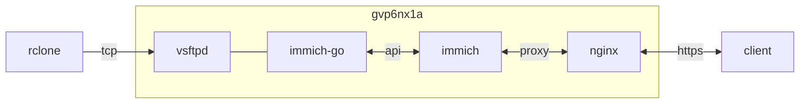

## container 구성

### .env
```sh
vi /opt/immich/.env
```
```ini
TZ=Asia/Seoul
IMMICH_VERSION=release
DB_PASSWORD=postgres
DB_USERNAME=postgres
DB_DATABASE_NAME=immich
```

### docker-compose.yml
```sh
vi /opt/immich/docker-compose.yml
```
```yml
services:
  immich-server:
    image: ghcr.io/immich-app/immich-server:${IMMICH_VERSION:-release}
    container_name: immich
    networks:
      - dev
    ports:
      - 2283:2283/tcp
    environment:
      - TZ=Asia/Seoul
    volumes:
      - /opt/immich/data:/data:rw
    restart: unless-stopped
    depends_on:
      - redis
      - database
  immich-machine-learning:
    image: ghcr.io/immich-app/immich-machine-learning:${IMMICH_VERSION:-release}
    container_name: immich_machine_learning
    networks:
      - dev
    environment:
      - TZ=Asia/Seoul
    volumes:
      - /opt/immich/cache:/cache:rw
    restart: unless-stopped
  redis:
    image: docker.io/valkey/valkey:8-bookworm@sha256:fea8b3e67b15729d4bb70589eb03367bab9ad1ee89c876f54327fc7c6e618571
    container_name: immich_redis
    networks:
      - dev
    environment:
      - TZ=Asia/Seoul
    restart: unless-stopped
  database:
    image: ghcr.io/immich-app/postgres:14-vectorchord0.4.3-pgvectors0.2.0@sha256:c44be5f2871c59362966d71eab4268170eb6f5653c0e6170184e72b38ffdf107
    container_name: immich_postgres
    networks:
      - dev
    user: 0:0
    environment:
      - TZ=Asia/Seoul
      - POSTGRES_PASSWORD=${DB_PASSWORD}
      - POSTGRES_USER=${DB_USERNAME}
      - POSTGRES_DB=${DB_DATABASE_NAME}
      - POSTGRES_INITDB_ARGS='--data-checksums'
    volumes:
      - /opt/immich/db_data:/var/lib/postgresql/data
    shm_size: 128mb
    restart: unless-stopped
networks:
  dev:
    external: true
```

### db 초기화
```sh
sudo rm -rf /opt/immich/db_data && sudo mkdir /opt/immich/db_data
```

## host 구성

### immich-go
로컬 폴더에서 immich 서버로 벌크 업로드
```sh
cd ~ && \
curl -L https://github.com/simulot/immich-go/releases/download/v0.28.0/immich-go_Linux_arm64.tar.gz > immich-go.tar.gz && \
tar -zxvf immich-go.tar.gz && \
rm ~/{LICENSE,immich-go.tar.gz} && \
sudo mv immich-go /usr/local/bin
```
```sh
/usr/local/bin/immich-go upload from-folder --server http://localhost:2283 --api-key 4***************************************** /home/dev/workspace/vscp5ekq/pictures
```

### crond [^1]
```sh
vi ~/.local/bin/immich_go.sh
```
```sh
#!/bin/bash
# immich-go로 로컬 폴더에서 immich 서버로 업로드
source /home/dev/.bashrc
source /home/dev/.local/bin/utils.sh
log_file=/home/dev/.local/log/$(basename "$0" | sed 's/.sh//').log
msg_file=/home/dev/.local/log/$(basename "$0" | sed 's/.sh//').tmp

WORK_DIR="$1"
cat /dev/null > "$log_file"
flock -n /tmp/immich-go.lock \
  /usr/local/bin/immich-go upload from-folder \
    --no-ui \
    --skip-verify-ssl \
    --server http://localhost:2283 \
    --api-key 4***************************************** \
    --log-file="$log_file" \
    "$WORK_DIR"
touch "$msg_file"
{ grep -oE "uploaded\s*:\s*[0-9]*" "$log_file" | sed 's/  */ /g'
  grep -oE "upload error\s*:\s*[0-9]*" "$log_file" | sed 's/  */ /g'
  grep -oE "file not selected\s*:\s*[0-9]*" "$log_file" | sed 's/  */ /g'
  grep -oE "server's asset upgraded with the input\s*:\s*[0-9]*" "$log_file" | sed  's/  */ /g'
  grep -oE "server has same asset\s*:\s*[0-9]*" "$log_file" | sed 's/  */ /g'
  grep -oE "server has a better asset\s*:\s*[0-9]*" "$log_file" | sed 's/  */ /g'
} >> "$msg_file"

# 마이그레이션된 파일 갯수가 일치하면 원본 삭제
file_cnt=$(find "$WORK_DIR" -type f | wc -l)
dup_cnt=$(grep -oE "server has same asset\s*:\s*[0-9]*" "$log_file" | grep -oE "[0-9]*")
if [[ $file_cnt -gt 0 && $file_cnt -eq $dup_cnt ]]; then
  if [ ! -d /tmp/immich-go ]; then
    mkdir -p /tmp/immich-go
  fi
  mv -f "$WORK_DIR"/* /tmp/immich-go
  rm -rf /tmp/immich-go
  sed -i "1i\Deletion of files ($file_cnt) successfully migrated completed" "$msg_file"
  send_tel_msg "$TEL_BOT_KEY" "$TEL_CHAT_ID" "$msg_file"
fi
rm "$msg_file"
```

[^1]: https://github.com/dntco43u/s6h7k8rv/blob/main/immich_go.sh
