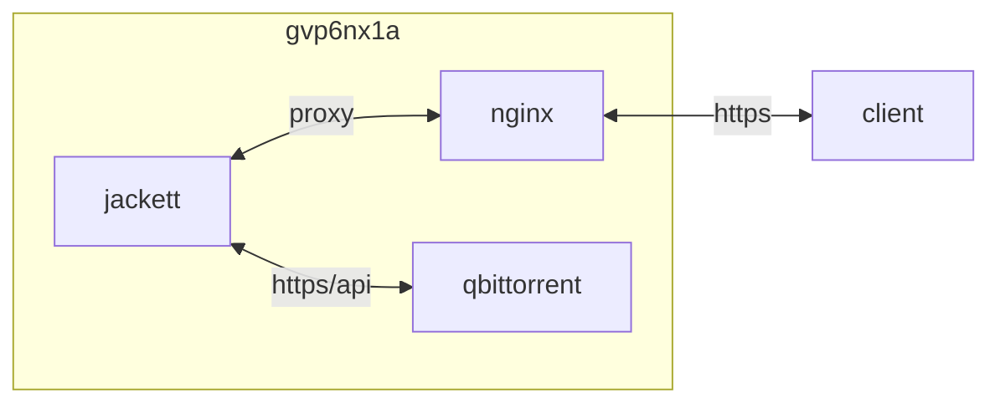

## container 구성

### docker-compose.yml
```sh
vi /opt/jackett/docker-compose.yml
```
```yml
services:
  jackett:
    image: lscr.io/linuxserver/jackett:latest
    container_name: jackett
    networks:
      - dev
    ports:
      - 9117/tcp
    user: 0:0
    environment:
      - PUID=1000
      - PGID=1000
      - AUTO_UPDATE=true
      - TZ=Asia/Seoul
    volumes:
      - /opt/jackett:/config:rw
      - /opt/qbittorrent/watched:/downloads:rw
    restart: unless-stopped
networks:
  dev:
    external: true
```

## host 구성

### logrotate
```sh
sudo vi /etc/logrotate.d/jackett
```
```
/opt/jackett/Jackett/log.txt*
/opt/jackett/Jackett/updater.txt* {
  daily
  rotate 7
  missingok
  notifempty
  dateext
  dateyesterday
  dateformat -%Y%m%d
  create 0664 dev dev
  sharedscripts
  postrotate
    docker restart jackett >/dev/null 2>&1 || true
  endscript
}
```
