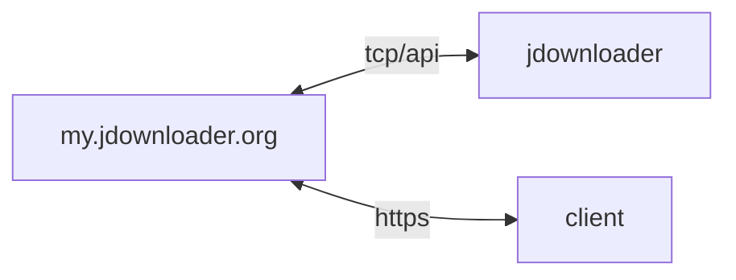

## host 구성

### 포트 개방
```sh
sudo firewall-cmd --permanent --add-forward-port=port=6****:proto=tcp:toport=3129 && \
sudo firewall-cmd --reload && \
sudo firewall-cmd --list-all
```

## container 구성

### .env
```sh
vi /opt/jdownloader/.env
```
```ini
JD_EMAIL=x*******-********@yahoo.com
JD_PASSWORD=y***************************************************************
```

### docker-compose.yml
```sh
vi /opt/jdownloader/docker-compose.yml
```
```yml
services:
  jdownloader:
    image: antlafarge/jdownloader:alpine
    container_name: jdownloader
    networks:
      - dev
    ports:
      - 3129:3129/tcp
    user: 1000:1000
    environment:
      - UID=1000
      - GID=1000
      - JD_DEVICENAME=$HOSTNAME
      - JD_EMAIL=$JD_EMAIL
      - JD_PASSWORD=$JD_PASSWORD
    volumes:
      - /etc/timezone:/etc/timezone:ro
      - /etc/localtime:/etc/localtime:ro
      - /opt/jdownloader/config:/jdownloader/cfg:rw
      - /opt/jdownloader/config/org.jdownloader.extensions.eventscripter.EventScripterExtension.scripts.json:/jdownloader/cfg/org.jdownloader.extensions.eventscripter.EventScripterExtension.scripts.json:ro
      - /home/dev/downloads:/jdownloader/downloads:rw
    restart: unless-stopped
networks:
  dev:
    external: true
```

### org.jdownloader.api.myjdownloader.MyJDownloaderSettings.json
포트 구성
```sh
vi /opt/jdownloader/config/org.jdownloader.api.myjdownloader.MyJDownloaderSettings.json
```
```json
{
  "uniquedeviceidsaltv2": "2***************************************************************",
  "autoconnectenabledv2": true,
  "debugenabled": false,
  "uniquedeviceid": null,
  "lastupnpport": 0,
  "lastlocalport": 3129,
  "latesterror": "NONE",
  "preferredipversion": "SYSTEM",
  "manuallocalport": 3129,
  "password": "y***************************************************************",
  "serverhost": "api.jdownloader.org",
  "directconnectmode": "LAN",
  "devicename": "g*******",
  "manualremoteport": 6****,
  "uniquedeviceidv2": "2*******************************",
  "email": "x*******-********@yahoo.com"
}
```

### org.jdownloader.extensions.eventscripter.EventScripterExtension.scripts.json
사용자 정의 javascript
- 자동 업데이트 (default)
- 다운로드 준비 시 알림
- 다운로드 완료 후 알리고 rclone 모니터링 폴더로 이동시킨다
```sh
vi /opt/jdownloader/config/org.jdownloader.extensions.eventscripter.EventScripterExtension.scripts.json
```
```javascript
...
"name": "Auto-update",
"script": "
disablePermissionChecks();
if (callAPI('update', 'isUpdateAvailable') && isDownloadControllerIdle() && !callAPI('linkcrawler', 'isCrawling') && !callAPI('linkgrabberv2', 'isCollecting') && !callAPI('extraction', 'getQueue').length > 0) {
    callAPI('update', 'restartAndUpdate');
}
"
...
"name": "started",
"script": "
disablePermissionChecks();
if (isDownloadControllerIdle()) {
    startDownloads();
    var tel_chat_id = '1*********';
    var tel_bot_key = '6*********************************************';
    var text = '<b>jdownloader</b>\\nstarted';
    postPage('https://api.telegram.org/bot' + tel_bot_key + '/sendMessage', 'parse_mode=HTML&disable_web_page_preview=False&chat_id=' + tel_chat_id + '&text=' + escape(text));
}
"
...
"name": "download-completed",
"script": "
disablePermissionChecks();
if (package.isFinished()) {
    var isMoved = getPath(package.getDownloadFolder()).moveTo(getPath('/jdownloader/downloads/watched/'));
    var tel_chat_id = '1*********';
    var tel_bot_key = '6*********************************************';
    if (isMoved) {
        var text = '<b>jdownloader</b>\\n' + package.getName() + ', ' + (package.getBytesTotal() / (1024 * 1024 * 1024)).toFixed(2) + ' GiB download completed';
        postPage('https://api.telegram.org/bot' + tel_bot_key + '/sendMessage', 'parse_mode=HTML&disable_web_page_preview=False&chat_id=' + tel_chat_id + '&text=' + escape(text));
    } else {
        var text = '<b>jdownloader</b>\\n' + package.getName() + ', ' + (package.getBytesTotal() / (1024 * 1024 * 1024)).toFixed(2) + ' GiB move failed';
        postPage('https://api.telegram.org/bot' + tel_bot_key + '/sendMessage', 'parse_mode=HTML&disable_web_page_preview=False&chat_id=' + tel_chat_id + '&text=' + escape(text));
    }
    package.remove();
}
"
...
```

## Troubleshooting
{}
> 자동 업데이트 시 사용자 스크립트 삭재됨

자동 업데이트 시 변경되지 않도록 EventScripterExtension.scripts.json을 읽기 전용으로 마운트 (docker-compose.yml)
{}

{}
> ISP DLIVE에서 api.jdownloader.org IP 차단 (88.99.115.46)

우회 필요. xray/wireguard로 우회됨을 확인 (2025-04)
{}
