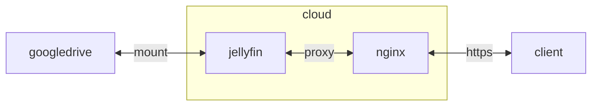

## container 구성

### docker-compose.yml
```sh
vi /opt/jellyfin/docker-compose.yml
```
```yml
services:
  jellyfin:
    image: jellyfin/jellyfin:latest
    container_name: jellyfin
    networks:
      - dev
    ports:
      - 8096/tcp
      - 8920/tcp
    user: 0:0
    environment:
      - JELLYFIN_PublishedServerUrl=https://je.gvp6nx1a.duckdns.org
      - TZ=Asia/Seoul
    volumes:
      - /opt/jellyfin/config:/config:rw
      - /opt/jellyfin/cache:/cache:rw
      - /home/dev/videos:/mnt/gvp6nx1a:rw
      - /mnt/ce9dbqya-gdrive/videos:/mnt/ce9dbqya:rw
    devices:
      - /dev/dri:/dev/dri
    privileged: true
    restart: unless-stopped
networks:
  dev:
    external: true
```

### Transcoding
vaapi 구성 확인
```sh
docker exec -it jellyfin /usr/lib/jellyfin-ffmpeg/ffmpeg -v debug -init_hw_device opencl
```
intel quicksync(qsv) 지원 확인
```sh
docker exec -it jellyfin /usr/lib/jellyfin-ffmpeg/ffmpeg -codecs | grep 'qsv'
```

## Troubleshooting
{}
> 헤놀 포럼 글 중에 아래 같은 글이 있는데 해당 댓글 중 BIOS에서 CPU 관련 옵션 중 VT-d 기능을 비활성화 시키면 H/W 트랜스코딩이 된다는 글을 보고 시도해 보았습니다.<br>
> 결과는 성공!! PLEX PASS 구매하고 J4105-ITX 보드 구매한 보람이 드디어 생겼습니다. [^1]

ASRock J4105/J5005ITX CMOS에서 VT-d 기능을 비활성화하면 Transcoding 가능
{}

[^1]: https://xpenology.com/forum/topic/14222-asrock-j4105-itx-test-transcoding-etc-with-asrock-j5005-itx-will-be-the-same/?tab=comments#comment-107981
