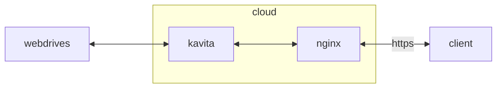

## container 구성

### docker-compose.yml
```sh
vi /opt/kavita/docker-compose.yml
```
```yml
services:
  kavita:
    image: lscr.io/linuxserver/kavita:latest
    container_name: kavita
    networks:
      - dev
    ports:
      - 5000/tcp
    user: 0:0
    environment:
      - PUID=1000
      - PGID=1000
      - TZ=Asia/Seoul
    volumes:
      - /opt/kavita/config:/config:rw
      - /mnt/ce9dbqya-gdrive/documents:/ce9dbqya:rw
      - /mnt/mgujomtd-gdrive/documents:/mgujomtd:rw
      - /mnt/wagimgxc-gdrive/documents:/wagimgxc:rw
      - /mnt/tsdfsvkx-gdrive/documents:/tsdfsvkx:rw
      - /mnt/aqn8dtkh-gdrive/documents:/aqn8dtkh:rw
      - /mnt/gvp6nx1a-alist/ndgzbj1c@teambition/documents:/ndgzbj1c:rw
    restart: unless-stopped
networks:
  dev:
    external: true
```

### 라이브러리 구조 [^1]
폴더 구조
- komga는 2 depth 이상의 구조로 관리 가능
- kavita는 2 depth 이상이면 이런저런 문제가 있으므로 1 depth 고정

파일명 접미어
- 단편의 경우 `c1`
- 1권 분량의 경우 `v1`
- 넣지 않을 경우 special로 처리됨

북 커버
- 단편, 여러 볼륨 상관없이 `________.webp`를 `filename.cbz`에 추가

[^1]: https://wiki.kavitareader.com/guides/scanner/managefiles

## Troubleshooting
{}
> 폴더 구조가 3 depth 이상일 때는 2 depth가 비어 있으면 스캔 중단됨

라이브러리 폴더 구조 1 depth로 고정
{}
