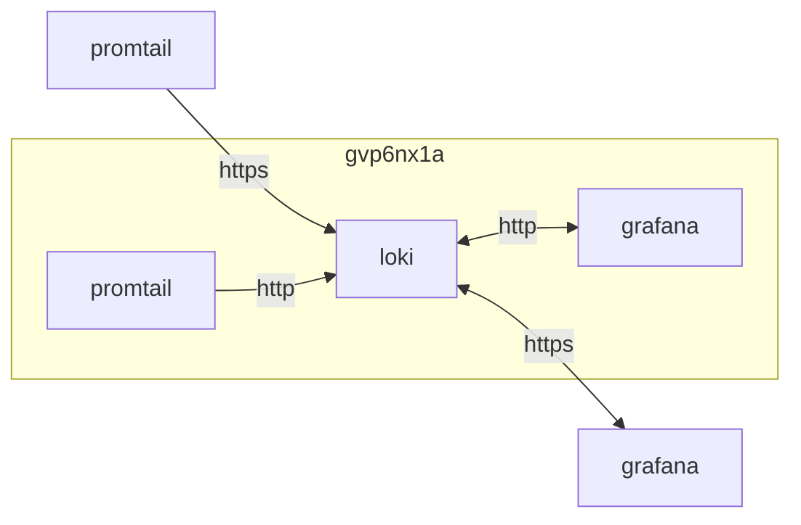

## container 구성

### docker-compose.yml
```sh
vi /opt/loki/docker-compose.yml
```
```yml
services:
  loki:
    image: grafana/loki:latest
    container_name: loki
    networks:
      - dev
    ports:
      - 3100/tcp
    user: 0:0
    volumes:
      - /opt/loki/config:/etc/loki:ro
      - /opt/loki/data:/loki:rw
    command:
    - --config.file=/etc/loki/local-config.yaml
    restart: unless-stopped
networks:
  dev:
    external: true
```

### ~~local-config.yaml~~
s3에 적재하는 구성
```sh
vi /opt/loki/config/local-config.yaml
```
```yml
auth_enabled: false

server:
  http_listen_port: 3100
  http_server_read_timeout: 600s
  http_server_write_timeout: 600s

common:
  ring:
    instance_addr: 127.0.0.1
    kvstore:
      store: inmemory
  replication_factor: 1
  path_prefix: /loki

schema_config:
  configs:
    - from: 2020-10-24
      store: tsdb
      object_store: aws
      schema: v13
      index:
        prefix: index_
        period: 24h

storage_config:
  tsdb_shipper:
    active_index_directory: /loki/index
    cache_location: /loki/index_cache
    cache_ttl: 24h
  aws:
    bucketnames: ahgcnzl5
    region: ap-seoul-1
    endpoint: https://c***********.compat.objectstorage.ap-seoul-1.oraclecloud.com
    access_key_id: 9***************************************
    secret_access_key: p*******************************************
    http_config:
      insecure_skip_verify: true
    insecure: true
    s3forcepathstyle: true

compactor:
  working_directory: /loki/compactor
  compaction_interval: 5m
  retention_enabled: true
  delete_request_store: aws

limits_config:
  allow_structured_metadata: true
```

### local-config.yaml
file에 적재하는 구성
```sh
vi /opt/loki/config/local-config.yaml
```
```yml
auth_enabled: false

server:
  http_listen_port: 3100

common:
  ring:
    instance_addr: 127.0.0.1
    kvstore:
      store: inmemory
  replication_factor: 1
  path_prefix: /loki

schema_config:
  configs:
    - from: 2020-10-24
      store: tsdb
      object_store: filesystem
      schema: v13
      index:
        prefix: index_
        period: 24h

storage_config:
  filesystem:
    directory: /loki/

ruler:
  storage:
    type: local
    local:
      directory: /loki/rules
  rule_path: /loki/scratch
  alertmanager_url: http://localhost
  ring:
    kvstore:
      store: inmemory
  enable_api: true

limits_config:
  retention_period: 7d
  allow_structured_metadata: true
  reject_old_samples: true
  reject_old_samples_max_age: 168h
  max_cache_freshness_per_query: 10m
  split_queries_by_interval: 15m
  #for big logs tune
  per_stream_rate_limit: 512M
  per_stream_rate_limit_burst: 1024M
  cardinality_limit: 200000
  ingestion_burst_size_mb: 1000
  ingestion_rate_mb: 10000
  max_entries_limit_per_query: 1000000
  max_label_value_length: 20480
  max_label_name_length: 10240
  max_label_names_per_series: 300
  max_query_series: 100000
  max_query_parallelism: 2

querier:
  max_concurrent: 16384
query_scheduler:
  max_outstanding_requests_per_tenant: 16384
query_range:
  parallelise_shardable_queries: true

ingester:
  chunk_encoding: snappy

compactor:
  retention_enabled: true
  delete_request_store: filesystem
  working_directory: /loki/compactor
  compaction_interval: 5m
```

### proxy 구성
특정 ip만 허용하도록 구성
```sh
vi /opt/nginx/config/sites-available/loki.conf
```
```
...
  location / {
    include                /etc/nginx/conf.d/include/proxy.conf;
    proxy_pass             http://loki:3100;
    auth_basic             "Authorization required";
    auth_basic_user_file   /etc/nginx/access/loki;
    proxy_intercept_errors on;
    allow                  192.168.0.0/16;
    allow                  2**.**.**.*;    #sj9n7air
    allow                  1**.***.**.*;   #ec4mrjp5
    allow                  1**.***.**.**;  #m7jrgve9
    allow                  1**.***.**.**;  #gvp6nx1a
    allow                  3*.***.***.***; #agknwpt3
    deny                   all;
  }
...
```
nginx에 http basic auth 추가
```sh
printf "dev:$(openssl passwd -apr1 a***************************************************************)\n" >> /opt/nginx/config/access/loki && \
chmod 755 /opt/nginx/config/access && \
chmod 644 /opt/nginx/config/access/loki && \
docker exec -it nginx nginx -s reload
```

## Troubleshooting
{}
> 최상의 성능을 위해 chunk_encoding 위해 snappy를 사용하십시오. [^1]

chunk_encoding 구성 추가 (local-config.yaml)
{}
{}
> Status: 500. Message: maximum of series (500) reached for a single query [^2]

max_query_series, max_query_parallelism 구성 추가 (local-config.yaml)
{}
{}
> Status: 504. Message: Get "http://...": net/http: timeout awaiting response headers (Client.Timeout exceeded while awaiting headers)

grafana 구성 변경 loki datasource 에서 timeout 300s으로 변경
{}
{}
> Status: 429

대용량 log용 구성 (local-config.yaml)
limits_config 구성 추가 (local-config.yaml)
{}

[^1]: https://grafana.com/blog/2023/12/28/the-concise-guide-to-loki-how-to-get-the-most-out-of-your-query-performance/
[^2]: https://github.com/grafana/loki/issues/3045
