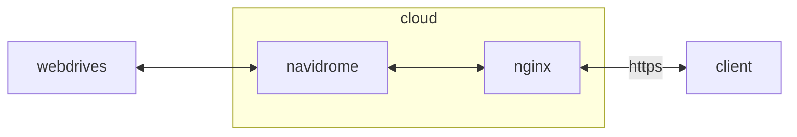

## .env
```sh
vi /opt/navidrome/.env
```
```ini
ND_SPOTIFY_ID=e*******************************
ND_SPOTIFY_SECRET=5*******************************
```

## docker-compose.yml
```sh
vi /opt/navidrome/docker-compose.yml
```
```yml
services:
  navidrome:
    image: deluan/navidrome:latest
    container_name: navidrome
    networks:
      - dev
    ports:
      - 4533/tcp
    user: 1000:1000
    environment:
      - ND_MUSICFOLDER=/music
      - ND_SCANSCHEDULE=24h
      - ND_LOGLEVEL=info
      - ND_SCANNER_EXTRACTOR=ffmpeg
      - ND_SPOTIFY_ID=$ND_SPOTIFY_ID
      - ND_SPOTIFY_SECRET=$ND_SPOTIFY_SECRET
      - ND_SCANNER_PURGEMISSING=always
    volumes:
      - /opt/navidrome/data:/data:rw
      - /mnt/uodacgt6-gdrive/music:/music/uodacgt6:ro
      - /mnt/pc9xqpnh-gdrive/music:/music/pc9xqpnh:ro
      - /mnt/dwecl0ir-gdrive/music:/music/dwecl0ir:ro
      - /mnt/zckmxa4g-gdrive/music:/music/zckmxa4g:ro
      - /mnt/wly1zcl7-onedrive/music:/music/wly1zcl7:ro
      - /mnt/tamg9wel-teldrive/music:/music/tamg9wel:ro
      - /etc/timezone:/etc/timezone:ro
      - /etc/localtime:/etc/localtime:ro
    restart: unless-stopped
networks:
  dev:
    external: true
```
