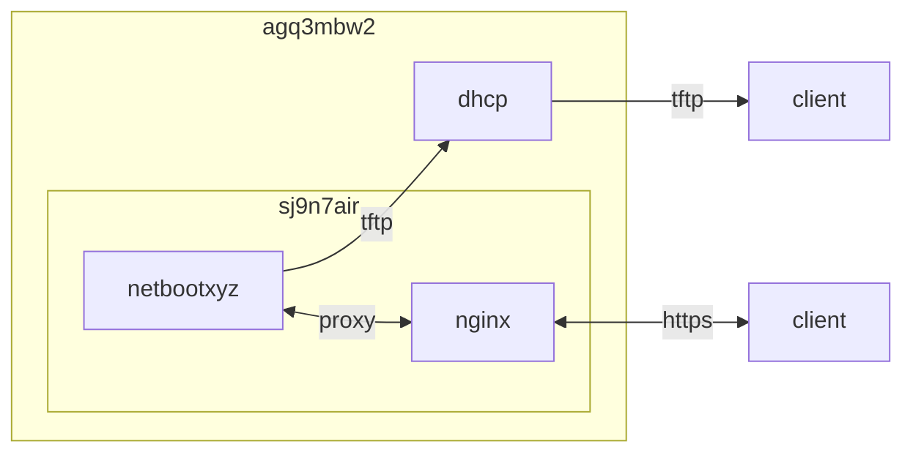

## host 구성

### 포트 개방
- tftp: 69번 포트<br>
- dhcp: 67번 포트(server, relay agent), 68번 포트(client) [^5]<br>
```sh
cat /usr/lib/firewalld/services/dhcp.xml | grep port && \
cat /usr/lib/firewalld/services/tftp.xml | grep port
  <port protocol="udp" port="67"/>
  <port protocol="udp" port="69"/>
```
```sh
sudo firewall-cmd --permanent --add-port=69/udp && \
sudo firewall-cmd --permanent --add-port=8080/tcp && \
sudo firewall-cmd --permanent --remove-port=16000/tcp && \
sudo firewall-cmd --permanent --remove-port=10809/tcp && \
sudo firewall-cmd --permanent --remove-port=67/udp && \
sudo firewall-cmd --reload && \
sudo firewall-cmd --list-all
```

### selinux
```sh
sudo setsebool -P tftp_anon_write 1 && \
sudo setsebool -P tftp_home_dir 1 && \
getsebool -a | grep tftp
```

## container 구성

### docker-compose.yml
```sh
vi /opt/netbootxyz/docker-compose.yml
```
```yml
services:
  netbootxyz:
    image: lscr.io/linuxserver/netbootxyz:latest
    container_name: netbootxyz
    networks:
      - dev
    ports:
      - 69:69/udp
      - 3000:3000/tcp
      - 8080:80/tcp
    user: 0:0
    environment:
      - PUID=1000
      - PGID=1000
      - TZ=Asia/Seoul
      - PORT_RANGE=30000:30010
      - NGINX_PORT=80
      - WEB_APP_PORT=3000
    volumes:
      - /opt/netbootxyz/config:/config:rw
      - /opt/netbootxyz/assets:/assets:rw
    restart: unless-stopped
networks:
  dev:
    external: true
```

### boot.cfg
```sh
vi /opt/netbootxyz/config/menus/local/boot.cfg
```
```ini
...
# set location of custom netboot.xyz live assets
#set live_endpoint https://github.com/netbootxyz
set live_endpoint http://sj9n7air:8080

######################################
# Media Locations for Licensed Distros
######################################
set rhel_base_url
set win_base_url ${live_endpoint}/custom/releases/download/windows11
set github_user dntco43u
...
```

### menu.ipxe
멀티 부팅 [^4]
- Lenovo Diagnostics UEFI
- Hirens BootCD PE
- Macrium Reflect
```sh
vi /opt/netbootxyz/config/menus/local/menu.ipxe
```
```ini
#!ipxe

:custom_menu
clear custom_choice
menu User menu
item ldiag_uefi ${space} Lenovo Diagnostics UEFI 4.34
item hiren_bootcd ${space} Hirens BootCD PE 1.0
item macrium_reflect ${space} Macrium Reflect 8.0
choose --default ${menu} menu || goto custom_exit
echo ${cls}
goto ${menu} ||
chain ${menu}.ipxe || goto custom_exit
goto custom_exit

# Lenovo Diagnostics UEFI
:ldiag_uefi
imgfree
kernel ${live_endpoint}/custom/releases/download/ldiag/4.34.001-uefi-x64/BOOTX64.efi
boot || goto custom_exit

# Hirens BootCD PE
:hiren_bootcd
imgfree
kernel https://boot.netboot.xyz/wimboot
initrd -n bootmgr     ${live_endpoint}/custom/releases/download/hbcd/1.0.8/BOOTMGR          bootmgr ||
initrd -n bootmgr.efi ${live_endpoint}/custom/releases/download/hbcd/1.0.8/bootmgr.efi      bootmgr.efi ||
initrd -n bcd         ${live_endpoint}/custom/releases/download/hbcd/1.0.8/boot/bcd         bcd ||
initrd -n boot.sdi    ${live_endpoint}/custom/releases/download/hbcd/1.0.8/boot/boot.sdi    boot.sdi ||
initrd -n boot.wim    ${live_endpoint}/custom/releases/download/hbcd/1.0.8/sources/boot.wim boot.wim
boot || goto custom_exit

# Macrium Reflect
:macrium_reflect
imgfree
kernel https://boot.netboot.xyz/wimboot
initrd -n bootmgr     ${live_endpoint}/custom/releases/download/macrium/8.0.7783/BOOTMGR          bootmgr ||
initrd -n bootmgr.efi ${live_endpoint}/custom/releases/download/macrium/8.0.7783/bootmgr.efi      bootmgr.efi ||
initrd -n bcd         ${live_endpoint}/custom/releases/download/macrium/8.0.7783/boot/bcd         bcd ||
initrd -n boot.sdi    ${live_endpoint}/custom/releases/download/macrium/8.0.7783/boot/boot.sdi    boot.sdi ||
initrd -n boot.wim    ${live_endpoint}/custom/releases/download/macrium/8.0.7783/sources/boot.wim boot.wim
boot || goto custom_exit

:custom_exit
clear menu
exit 0
```

## openwrt 구성

###  dhcp 서버
```sh
vi /etc/dnsmasq.conf
```
```ini
#pxe boot
dhcp-match=set:bios,60,PXEClient:Arch:00000
dhcp-boot=tag:bios,netboot.xyz.kpxe,,sj9n7air
dhcp-match=set:efi32_0,60,PXEClient:Arch:00002
dhcp-boot=tag:efi32_0,netboot.xyz.efi,,sj9n7air
dhcp-match=set:efi32_1,60,PXEClient:Arch:00006
dhcp-boot=tag:efi32_1,netboot.xyz.efi,,sj9n7air
dhcp-match=set:efi64_0,60,PXEClient:Arch:00007
dhcp-boot=tag:efi64_0,netboot.xyz.efi,,sj9n7air
dhcp-match=set:efi64_1,60,PXEClient:Arch:00008
dhcp-boot=tag:efi64_1,netboot.xyz.efi,,sj9n7air
dhcp-match=set:efi64_2,60,PXEClient:Arch:00009
dhcp-boot=tag:efi64_2,netboot.xyz.efi,,sj9n7air
```
```sh
/etc/init.d/dnsmasq restart
```

## Troubleshooting
{}
> boot.cfg, menu.ipxe, custom.ipxe 수정 사항 반영 안 됨

직접 수정 시 반영되지 않고 web-ui에서 수정해야 반영됨
{}
{}
> iso 사용 불가

압축 해제 후 사용 (iventoy는 iso 지원)
```sh
7z x -y -o/opt/netbootxyz/assets/custom/releases/download/windows11/x64/ /opt/netbootxyz/assets/custom/releases/download/windows11/x64/Win11_23H2_English_x64.iso
```
{}

[^1]: https://www.hirensbootcd.org/files/HBCD_PE_x64.iso
[^2]: https://www.macrium.com/reflectfree
[^3]: https://download.lenovo.com/pccbbs/thinkvantage_en/ldiag_v04.34.001_bootable_uefi.zip
[^4]: https://github.com/dntco43u/netboot.xyz-custom/blob/main/custom.ipxe
[^5]: iventoy의 경우 외부 dhcp를 사용하더라도 67번 개방 필요
