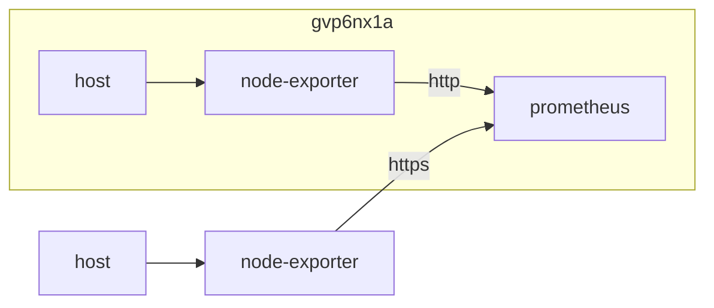

## container 구성

### docker-compose.yml
수집 데이터에 접근하기 위해 host 모드로 구성

```sh
vi /opt/node-exporter/docker-compose.yml
```
```yml
services:
  node-exporter:
    image: prom/node-exporter:latest
    container_name: node-exporter
    network_mode: host
    pid: host
    user: 1000:1000
    volumes:
      - /:/rootfs:ro
      - /proc:/rootfs/proc:ro
      - /sys:/rootfs/sys:ro
      - /run/udev/data:/run/udev/data:ro
      - /var/run/dbus/system_bus_socket:/var/run/dbus/system_bus_socket:ro
      - /etc/timezone:/etc/timezone:ro
      - /etc/localtime:/etc/localtime:ro
      - /opt/node-exporter/config/web.yml:/etc/web.yml:rw
    command:
      - --web.config.file=/etc/web.yml
      - --path.rootfs=/rootfs
      - --path.procfs=/rootfs/proc
      - --path.sysfs=/rootfs/sys
      - --collector.filesystem.mount-points-exclude=^/(rootfs/)?(dev|etc|proc|run|sys)($$|/)
      - --collector.processes
      - --collector.systemd
      - --collector.interrupts
    restart: unless-stopped
```

### web.yml
http basic auth 구성
```sh
pip install bcrypt && \
tee ~/gen-password.py <<EOF
import getpass
import bcrypt

password = getpass.getpass("password: ")
hashed_password = bcrypt.hashpw(password.encode("utf-8"), bcrypt.gensalt())
print(hashed_password.decode())
EOF
```

```sh
python3 ~/gen-password.py
```
```
password:
$***********************************************************
```

```sh
pip uninstall -y bcrypt && rm ~/gen-password.py && \
tee /opt/node-exporter/config/web.yml <<EOF
basic_auth_users:
  dev: $***********************************************************
EOF
```

## host 구성

### proxy 구성
특정 ip만 허용하도록 구성
```sh
vi /opt/nginx/config/sites-available/node-exporter.conf
```
```conf
...
  location / {
    include                /etc/nginx/conf.d/include/proxy.conf;
    proxy_pass             http://host.docker.internal:9100;
    proxy_intercept_errors on;
    allow                  192.168.0.0/16;
    allow                  2**.**.**.*;   #sj9n7air
    allow                  1**.***.**.**; #gvp6nx1a
    deny                   all;
  }
...
```

## Troubleshooting
{}
> Recommended for prometheus-node-exporter the arguments ‘–collector.systemd –collector.processes’ because the graph uses some of their metrics. [^1]

collector.systemd, collector.processes 옵션 추가 (docker-compose.yml)
{}

{}
> ts=2023-09-17T03:49:50.864Z caller=collector.go:169 level=error msg="collector failed" name=netclass duration_seconds=0.294694918 err="could not get net class info: failed to read file \"/host/sys/class/net/veth10d18cc/speed\": no such device"

docker 구성 변경 network_mode: host (docker-compose.yml)
{}

{}
> udev 오류

`/run/udev/data` mount 구성 (docker-compose.yml)
{}

[^1]: https://grafana.com/grafana/dashboards/1860-node-exporter-full
