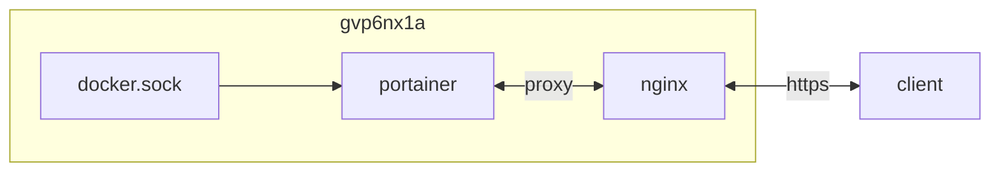

## container 구성

### docker-compose.yml
```sh
vi /opt/portainer/docker-compose.yml
```
```yml
services:
  portainer:
    image: portainer/portainer-ce:alpine
    container_name: portainer
    networks:
      - dev
    ports:
      - 8000/tcp
      - 9443/tcp
    user: 0:0
    volumes:
      - /var/run/docker.sock:/var/run/docker.sock:ro
      - /etc/timezone:/etc/timezone:ro
      - /etc/localtime:/etc/localtime:ro
      - /opt/portainer/data:/data:rw
    restart: unless-stopped
networks:
  dev:
    external: true
```
