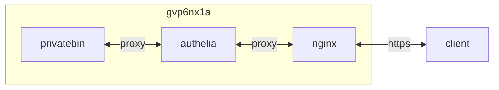

## container 구성

### docker-compose.yml
```sh
vi /opt/privatebin/docker-compose.yml
```
```yml
services:
  privatebin:
    image: privatebin/fs:latest
    container_name: privatebin
    networks:
      - dev
    ports:
      - 8080/tcp
    user: 65534:82
    environment:
      - TZ=Asia/Seoul
      - PHP_TZ=Asia/Seoul
    volumes:
      - /opt/privatebin/config:/srv/cfg:rw
      - /opt/privatebin/data:/srv/data:rw
      - /opt/privatebin/tmp:/tmp:rw
      - /opt/privatebin/run:/run:rw
      - /opt/privatebin/nginx_tmp:/var/lib/nginx/tmp:rw
    read_only: true
    restart: unless-stopped
networks:
  dev:
    external: true
```

### proxy 구성
[authelia](https://hu.gvp6nx1a.duckdns.org/apps/authelia/#proxy-%EA%B5%AC%EC%84%B1) 구성
```sh
vi /opt/nginx/config/sites-available/privatebin.conf
```
```
...
  location /authelia {
    if ($allowed_country = no) {
      return 403;
    }
    include /etc/nginx/snippets/authelia-api.conf;
  }
  location / {
    if ($allowed_country = no) {
      return 403;
    }
    proxy_pass http://privatebin:8080;
    include    /etc/nginx/snippets/authelia-auth.conf;
    add_header 'Cross-Origin-Embedder-Policy' 'require-corp';
    add_header 'Cross-Origin-Opener-Policy'   'same-origin';
    add_header 'Cross-Origin-Resource-Policy' 'same-site';
  }
...
```

## Troubleshooting
{}
> cp: can't create '/run/services/nginx/supervise/control': File exists

```sh
sudo rm -rf /opt/privatebin/run/*
```
{}
