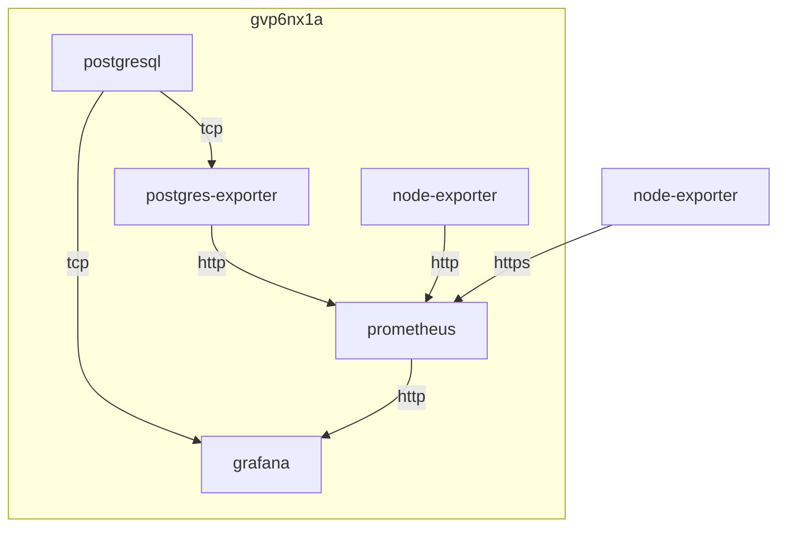

## container 구성

### docker-compose.yml
```sh
vi /opt/prometheus/docker-compose.yml
```
```yml
services:
  prometheus:
    image: prom/prometheus:latest
    container_name: prometheus
    networks:
      - dev
    ports:
      - 9090/tcp
    user: 0:0
    volumes:
      - /opt/prometheus/config:/etc/prometheus:rw
      - /opt/prometheus/data:/prometheus:rw
    command:
      - --config.file=/etc/prometheus/prometheus.yml
      - --web.config.file=/etc/prometheus/web.yml
      - --storage.tsdb.path=/prometheus
      - --storage.tsdb.retention.time=7d
    restart: unless-stopped
networks:
  dev:
    external: true
```

### 일반 구성
file service discovery 구성
| Filename       | Remarks                |
|----------------|------------------------|
| node_owrt.json | openwrt 메트릭 수집    |
| node_rhel.json | rhel 메트릭 수집       |
| pgsql.json     | postgresql 메트릭 수집 |

```sh
vi /opt/prometheus/config/node_owrt.json
```
```json
[
  {
    "targets": [
      "an.sj9n7air.duckdns.org:9***"
    ],
    "labels": {
      "alias": "agq3mbw2",
      "port": "9***"
    }
  }
]
```

```sh
vi /opt/prometheus/config/node_rhel.json
```
```json
[
  {
    "targets": [
      "no.sj9n7air.duckdns.org:443"
    ],
    "labels": {
      "alias": "sj9n7air"
    }
  },
  {
    "targets": [
      "no.ec4mrjp5.duckdns.org:443"
    ],
    "labels": {
      "alias": "ec4mrjp5"
    }
  },
  {
    "targets": [
      "no.m7jrgve9.duckdns.org:443"
    ],
    "labels": {
      "alias": "m7jrgve9"
    }
  },
  {
    "targets": [
      "no.gvp6nx1a.duckdns.org:443"
    ],
    "labels": {
      "alias": "gvp6nx1a"
    }
  }
]
```

```sh
vi /opt/prometheus/config/pgsql.json
```
```json
[
  {
    "targets": [
      "pgsql-exporter:9187"
    ],
    "labels": {
      "alias": "gvp6nx1a"
    }
  }
]
```

```sh
vi /opt/prometheus/config/prometheus.yml
```
```yml
global:
  scrape_interval:     15s
  evaluation_interval: 15s

# Alertmanager configuration
alerting:
  alertmanagers:
  - static_configs:
    - targets:
      # - alertmanager:9093

# Load and evaluate rules in this file every evaluation_interval seconds.
rule_files:
  # - first_rules.yml
  # - second_rules.yml

# A scrape configuration containing exactly one endpoint to scrape.
scrape_configs:
  - job_name: node-owrt
    file_sd_configs:
    - files:
      - node_owrt.json
    scheme: http #agq3mbw2
    #scheme: https #sj9n7air
    basic_auth:
      username: dev
      password: _***************************************************************

  - job_name: node-rhel
    file_sd_configs:
    - files:
      - node_rhel.json
    scheme: https
    basic_auth:
      username: dev
      password: H***************************************************************

  - job_name: pgsql
    file_sd_configs:
    - files:
      - pgsql.json
    scheme: http
```

### web.yml
http basic auth 구성
```sh
pip install bcrypt && \
tee ~/gen-password.py <<EOF
import getpass
import bcrypt

password = getpass.getpass("password: ")
hashed_password = bcrypt.hashpw(password.encode("utf-8"), bcrypt.gensalt())
print(hashed_password.decode())
EOF
```

```sh
python3 ~/gen-password.py
```
```
password:
$***********************************************************
```

```sh
pip uninstall -y bcrypt && rm ~/gen-password.py && \
tee /opt/prometheus /config/web.yml <<EOF
basic_auth_users:
  dev: $***********************************************************
EOF
```

## host 구성

### proxy 구성
특정 ip만 허용하도록 구성
```sh
vi /opt/nginx/config/sites-available/prometheus.conf
```
```
...
  location / {
    include                /etc/nginx/conf.d/include/proxy.conf;
    proxy_pass             http://prometheus:9090;
    proxy_intercept_errors on;
    allow                  192.168.0.0/16;
    allow                  2**.**.**.*;    #sj9n7air
    allow                  1**.***.**.**;  #gvp6nx1a
    allow                  3*.***.***.***; #agknwpt3
    deny                   all;
  }
...
```

## Troubleshooting
{}
> timezone utc 고정 [^1]

변경 불가. 단 grafana에서 timezone 변경 가능
{}

[^1]: https://prometheus.io/docs/alerting/latest/configuration/
