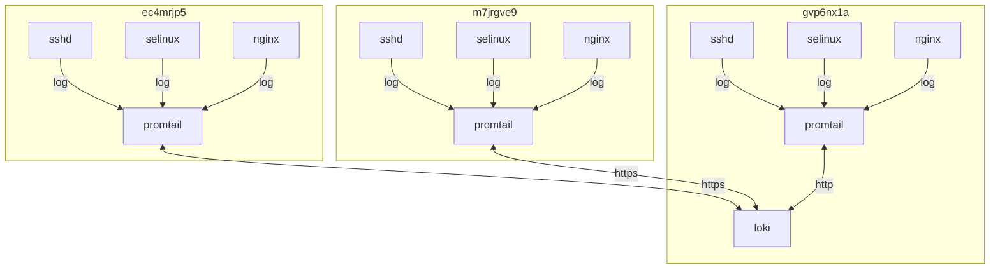

## container 구성

### .env
```sh
vi /opt/promtail/.env
```
```ini
LOKI_URL=http://loki:3100/loki/api/v1/push
LOKI_USERNAME=dev
LOKI_PASSWORD=a***************************************************************
```

### docker-compose.yml
```sh
vi /opt/promtail/docker-compose.yml
```
```yml
services:
  promtail:
    image: grafana/promtail:latest
    container_name: promtail
    networks:
      - dev
    ports:
      - 9080/tcp
    user: 0:0
    environment:
      - LOKI_URL=$LOKI_URL
      - LOKI_USERNAME=$LOKI_USERNAME
      - LOKI_PASSWORD=$LOKI_PASSWORD
      - TZ=Asia/Seoul
    volumes:
      - /var/log/secure:/var/log/secure:ro
      - /var/log/audit/audit.log:/var/log/audit/audit.log:ro
      - /opt/promtail/config:/etc/promtail:ro
      - /opt/nginx/log:/var/log/nginx:ro
    command:
      - --config.file=/etc/promtail/config.yml
      - --config.expand-env=true
    restart: unless-stopped
networks:
  dev:
    external: true
```

### config.yml
수집할 로그 구성
| Filepath                    | Remarks                  |
|-----------------------------|--------------------------|
| /var/log/nginx/*_access.log | nginx site별 access 로그 |
| /var/log/secure             | sshd 로그                |
| /var/log/audit/audit.log    | selinux 감사 로그        |


```sh
vi /opt/promtail/config/config.yml
```
```yml
server:
  http_listen_port: 9080
  grpc_listen_port: 0

positions:
  filename: /tmp/positions.yaml

clients:
  - url: ${LOKI_URL}
    basic_auth:
      username: ${LOKI_USERNAME}
      password: ${LOKI_PASSWORD}

scrape_configs:
- job_name: nginx
  static_configs:
  - targets:
      - localhost
    labels:
      job: nginx
      instance: gvp6nx1a
      __path__: /var/log/nginx/*_access.log

- job_name: secure
  static_configs:
  - targets:
      - localhost
    labels:
      job: secure
      instance: gvp6nx1a
      __path__: /var/log/secure

- job_name: audit
  static_configs:
  - targets:
      - localhost
    labels:
      job: audit
      instance: gvp6nx1a
      __path__: /var/log/audit/audit.log
```

## host 구성

### logrotate
create 방식으로 구성. promtail 서비스 재시작 필요
| Type         | inode 변경 | 안정성                     | Remarks                                            |
|--------------|------------|----------------------------|----------------------------------------------------|
| copytruncate | X          | 전송 속도에 따라 유실 우려 | 원본 로그 파일을 복사한 뒤 원본 파일의 내용을 비움 |
| create       | O          | 무결성 보장                | 기존 파일을 삭제하고 새로운 파일을 만듦            |

```sh
sudo vi /etc/logrotate.d/nginx
```
```
/opt/nginx/log/*.log {
  daily
  rotate 7
  missingok
  notifempty
  dateext
  dateyesterday
  dateformat -%Y%m%d
  nocompress
  create 0664 dev dev
  sharedscripts
  postrotate
    docker exec nginx nginx -s reload >/dev/null 2>&1 || true
    docker restart promtail >/dev/null 2>&1 || true
  endscript
}
```

```sh
sudo vi /etc/logrotate.d/rsyslog
```
```
/var/log/cron
/var/log/maillog
/var/log/messages
/var/log/secure
/var/log/spooler {
  daily
  rotate 7
  missingok
  notifempty
  dateext
  dateyesterday
  dateformat -%Y%m%d
  create 0664 root root
  sharedscripts
  postrotate
    /usr/bin/systemctl -s HUP kill rsyslog.service >/dev/null 2>&1 || true
    docker restart promtail >/dev/null 2>&1 || true
  endscript
}
```
