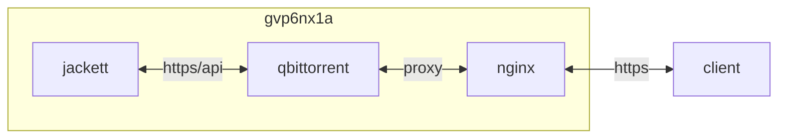

## container 구성

### .env
```sh
vi /opt/qbittorrent/.env
```
```ini
TEL_BOT_KEY=6*********************************************
TEL_CHAT_ID=1*********
```

### docker-compose.yml
```sh
vi /opt/qbittorrent/docker-compose.yml
```
```yml
services:
  qbittorrent:
    image: lscr.io/linuxserver/qbittorrent:latest
    container_name: qbittorrent
    networks:
      - dev
    ports:
      - 8080/tcp
      - 6881:6881
    user: 0:0
    environment:
      - PUID=1000
      - PGID=1000
      - UMASK=022
      - TZ=Asia/Seoul
      - WEBUI_PORT=8080
      - TORRENTING_PORT=6881
      - TEL_BOT_KEY=$TEL_BOT_KEY
      - TEL_CHAT_ID=$TEL_CHAT_ID
    volumes:
      - /opt/qbittorrent/config:/config:rw
      - /opt/qbittorrent/watched:/watched:rw
      - /home/dev/videos:/videos:rw
      - /home/dev/.local/bin/utils.sh:/config/utils.sh:ro
      - /home/dev/downloads:/downloads:rw
      - /home/dev/videos:/videos:rw
    restart: unless-stopped
networks:
  dev:
    external: true
```

### jackett plugin
```sh
vi /opt/qbittorrent/config/qBittorrent/nova3/engines/jackett.json
```
```json
{
    "api_key": "s*******************************",
    "thread_count": 20,
    "tracker_first": false,
    "url": "https://ja.gvp6nx1a.duckdns.org"
}
```

### 완료 시 [^1]
```sh
vi /opt/qbittorrent/config/qbittorrent_complete.sh
```
```sh
#!/bin/bash
# qbittorrent 다운로드 알림

source /config/utils.sh
log_file=/tmp/$(basename "$0" | sed 's/.sh//').log
msg_file=/tmp/$(basename "$0" | sed 's/.sh//').tmp

gib=$(awk 'BEGIN {printf "%.2f", '"$2"' / (1024 * 1024 * 1024)}')

echo "$1, $gib GiB download completed" > "$log_file"
cp "$log_file" "$msg_file"
send_tel_msg "$TEL_BOT_KEY" "$TEL_CHAT_ID" "$msg_file"
rm "$msg_file"

#do not download 폴더, 파일 삭제
find "/downloads/watched" -type d -name ".unwanted" | sed 's/\/.unwanted/"/' |  sed 's/^/"/g' | xargs rm -rf
find "/downloads/watched" -type f -name "*.\!qB"
find "/downloads/complete" -type d -name ".unwanted" | sed 's/\/.unwanted/"/' |  sed 's/^/"/g' | xargs rm -rf
find "/downloads/complete" -type f -name "*.\!qB"
```

## host 구성

### 포트 개방
```sh
sudo firewall-cmd --permanent --add-forward-port=port=6****:proto={tcp,udp}:toport=6881 && \
sudo firewall-cmd --reload && \
sudo firewall-cmd --list-all
```

### crond [^2]
```sh
vi ~/.local/bin/update_ipfilter.sh
```
```sh
#!/bin/bash
# ipfilter.dat 데이터베이스 갱신

source /home/dev/.bashrc
source /home/dev/.local/bin/utils.sh
log_file=/home/dev/.local/log/$(basename "$0" | sed 's/.sh//').log
msg_file=/home/dev/.local/log/$(basename "$0" | sed 's/.sh//').tmp

{ curl http://upd.emule-security.org/ipfilter.zip \
    -o /opt/qbittorrent/config/ipfilter.zip
  7z e /opt/qbittorrent/config/ipfilter.zip \
    -o/opt/qbittorrent/config
  mv /opt/qbittorrent/config/guarding.p2p \
    /opt/qbittorrent/config/ipfilter.dat
  rm /opt/qbittorrent/config/ipfilter.zip
} > "$log_file"
show_file_stat /opt/qbittorrent/config/ipfilter.dat > "$msg_file"
send_tel_msg "$TEL_BOT_KEY" "$TEL_CHAT_ID" "$msg_file"
rm "$msg_file"
```
```sh
docker restart qbittorrent && \
grep "IP filter" /opt/qbittorrent/config/qBittorrent/data/logs/qbittorrent.log
```

## Troubleshooting
{}
> libtorrent v2.0 메모리 누수

~~libtorrent v1.2를 사용하는 마지막 버전 v4.3.9로 고정~~ [^3]<br>
v5.1.2 메모리 누수 없음 (2025-11)
{}

[^1]: https://github.com/dntco43u/s6h7k8rv/blob/main/qbittorrent_complete.sh
[^2]: https://github.com/dntco43u/s6h7k8rv/blob/main/update_ipfilter.sh
[^3]: https://www.reddit.com/r/qBittorrent/comments/suuoi3/does_441_fix_440s_memory_leak_issues/
