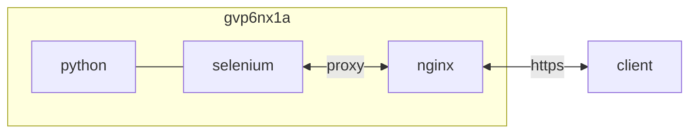

## container 구성

### .env
```sh
vi /opt/python/.env
```
```ini
WEBDRIVER_URL=http://selenium:4444/wd/hub
```

### docker-compose.yml
```sh
vi /opt/selenium/docker-compose.yml
```
```yml
services:
  selenium:
    image: seleniarm/standalone-chromium:latest
    container_name: selenium
    networks:
      - dev
    ports:
      - 4444/tcp
      - 5900/tcp
      - 7900/tcp
    user: 0:0
    environment:
      - TZ=Asia/Seoul
    volumes:
      - /opt/selenium/config/passwd:/home/seluser/.vnc/passwd:ro
      - /home/dev/downloads/selenium:/home/seluser/files:rw
    privileged: true
    shm_size: 2gb
    restart: unless-stopped
networks:
  dev:
    external: true
```

### passwd
```sh
docker exec -it selenium x11vnc -storepasswd P*************************************************************** /home/seluser/.vnc/passwd
```

### proxy 구성
```sh
vi /opt/nginx/config/sites-available/selenium.conf
```
```
...
  location / {
    if ($allowed_country = no) {
      return 403;
    }
    include    /etc/nginx/conf.d/include/proxy.conf;
    proxy_pass http://selenium:7900;
    proxy_buffering         off;
    proxy_request_buffering off;
  }
...
```
