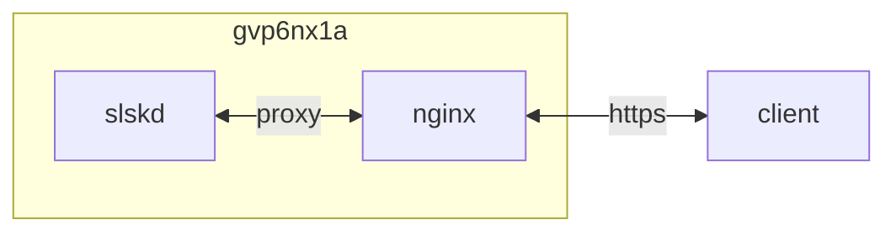

## host 구성

### 포트 개방
```sh
sudo firewall-cmd --permanent --add-forward-port=port=6****:proto=tcp:toport=2234 && \
sudo firewall-cmd --reload && \
sudo firewall-cmd --list-all
```

## container 구성

### docker-compose.yml
```sh
vi /opt/slskd/docker-compose.yml
```
```yml
services:
  slskd:
    image: slskd/slskd:latest
    container_name: slskd
    networks:
      - dev
    ports:
      - 5030/tcp
      - 2234:6****/tcp
    user: 1000:1000
    environment:
      - SLSKD_REMOTE_CONFIGURATION=true
      - TZ=Asia/Seoul
    volumes:
      - /opt/slskd/config:/app:rw
      - /home/dev/downloads:/downloads:rw
      - /mnt/pc9xqpnh-gdrive/music:/music:rw
    restart: unless-stopped
networks:
  dev:
    external: true
```
