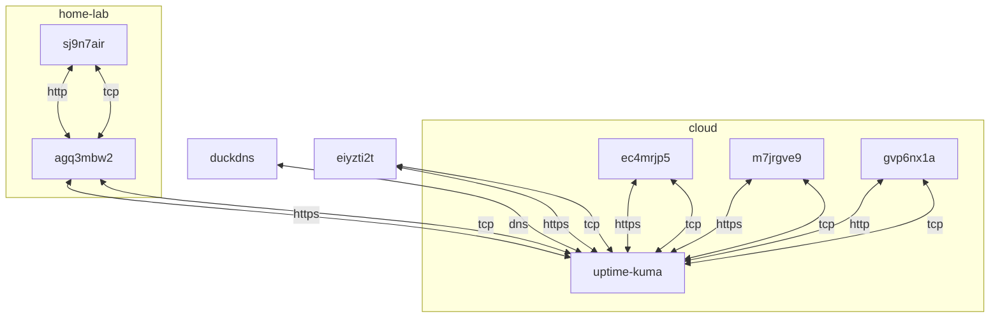

## container 구성

### docker-compose.yml
```sh
vi /opt/uptime-kuma/docker-compose.yml
```
```yml
services:
  uptime-kuma:
    image: louislam/uptime-kuma:latest
    container_name: uptime-kuma
    networks:
      - dev
    ports:
      - 3001/tcp
    extra_hosts:
      - "host.docker.internal:host-gateway"
    user: 0:0
    volumes:
      - /opt/uptime-kuma/data:/app/data:rw
      - /var/run/docker.sock:/var/run/docker.sock:ro
      #- /etc/timezone:/etc/timezone:ro
      - /etc/localtime:/etc/localtime:ro
    restart: unless-stopped
networks:
  dev:
    external: true
```

## 데모 페이지


[바로 가기](https://up.gvp6nx1a.duckdns.org/status/all)

## Troubleshooting
{}
> getaddrinfo EAI_AGAIN

> 모니터링되는 사이트에 대한 DNS 조회가 어떤 이유로 시간 초과됨을 의미합니다.<br>
> 이는 하루에 수천 개의 모니터링 요청을 수행할 때 지극히 정상입니다.<br>
> 이러한 경우 경고가 표시되지 않도록 하려면 다시 시도를 2 또는 3 이상으로 설정해야 합니다.<br>
> 그렇게 하면 경고를 트리거 하기 전에 사이트가 실제로 다운되었는지 확인할 수 있습니다.<br>

duckdns 서버에서 주기적으로 발생. 무료 서비스라 감내해야 함
{}
