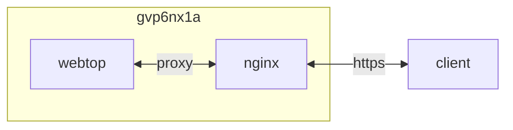

## container 구성

### docker-compose.yml
```sh
vi /opt/webtop/docker-compose.yml
```
```yml
services:
  webtop:
    image: raindev11/webtop:latest
    container_name: webtop
    networks:
      - dev
    ports:
      - 3000/tcp
      - 3001/tcp
    user: 0:0
    environment:
      - PUID=1000
      - PGID=1000
      - TZ=Asia/Seoul
      - START_DOCKER=false
      - DRINODE=/dev/dri/renderD128
    volumes:
      - /opt/webtop/config:/config:rw
      - /var/run/docker.sock:/var/run/docker.sock:ro
    security_opt:
      - seccomp:unconfined
    shm_size: 2gb
    devices:
      - /dev/dri:/dev/dri
    privileged: true
    restart: unless-stopped
networks:
  dev:
    external: true
```

### proxy 구성
[authelia](https://hu.gvp6nx1a.duckdns.org/apps/authelia/#proxy-%EA%B5%AC%EC%84%B1) 구성
```sh
vi /opt/nginx/config/sites-available/webtop.conf
```
```
...
  location /authelia {
    if ($allowed_country = no) {
      return 403;
    }
    include /etc/nginx/snippets/authelia-api.conf;
  }
  location / {
    if ($allowed_country = no) {
      return 403;
    }
    proxy_pass http://webtop:3000;
    include    /etc/nginx/snippets/authelia-auth.conf;
    add_header 'Cross-Origin-Embedder-Policy' 'require-corp';
    add_header 'Cross-Origin-Opener-Policy'   'same-origin';
    add_header 'Cross-Origin-Resource-Policy' 'same-site';

    proxy_buffering         off;
    proxy_request_buffering off;
  }
...
```

## Troubleshooting
{}
> failed to load listeners: can't create unix socket /var/run/docker.sock: device or resource busy

START_DOCKER=false 환경 변수 추가 (docker-compose.yml)
{}
