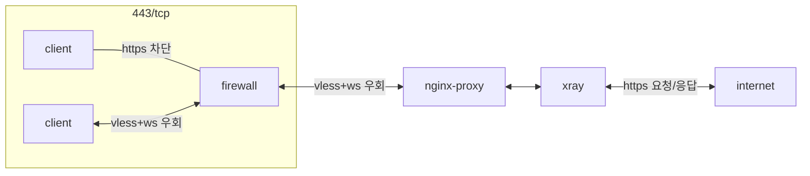

## container 구성

### docker-compose.yml
```sh
vi /opt/xray/docker-compose.yml
```
```yml
services:
  xray:
    image: teddysun/xray:1.7.5
    container_name: xray
    networks:
      - dev
    ports:
      - 9000/tcp
    user: 0:0
    environment:
      - TZ=Asia/Seoul
    volumes:
      - /opt/xray/config:/etc/xray:rw
      - /opt/.acme/*.$HOSTNAME.duckdns.org_ecc/fullchain.cer:/etc/ssl/*.$HOSTNAME.duckdns.org/fullchain.pem:ro
      - /opt/.acme/*.$HOSTNAME.duckdns.org_ecc/*.$HOSTNAME.duckdns.org.key:/etc/ssl/*.$HOSTNAME.duckdns.org/privkey.pem:ro
    restart: unless-stopped
networks:
  dev:
    external: true
```

### vless-websocket-tls (서버)
```sh
vi /opt/xray/config/config.json
```
```json
{
   "log":{
      "loglevel":"warning"
   },
   "inbounds":[
      {
         "port":9000,
         "protocol":"vless",
         "settings":{
            "clients":[
               {
                  "id":"5*******-****-****-****-************",
                  "flow":"xtls-rprx-direct"
               }
            ],
            "decryption":"none",
            "fallbacks":[]
         },
         "streamSettings":{
            "network":"ws",
            "security":"tls",
            "tlsSettings":{
               "serverName":"xr.gvp6nx1a.duckdns.org",
               "certificates":[
                  {
                     "certificateFile":"/etc/ssl/*.gvp6nx1a.duckdns.org/fullchain.pem",
                     "keyFile":"/etc/ssl/*.gvp6nx1a.duckdns.org/privkey.pem"
                  }
               ]
            },
            "wsSettings":{
               "path":"/w*******",
               "headers":{}
            }
         },
         "tag":"inbound",
         "sniffing":{
            "enabled":true,
            "destOverride":[
               "http",
               "tls"
            ]
         }
      }
   ],
   "outbounds":[
      {
         "protocol":"freedom"
      }
   ]
}
```

### vless-websocket-tls (클라이언트)
```sh
vi $USERPROFILE/AppData/Local/qv2ray/connections/maellhfkxqke.qv2ray.json
```
```json
{
    "outbounds": [
        {
            "protocol": "vless",
            "settings": {
                "vnext": [
                    {
                        "address": "xr.gvp6nx1a.duckdns.org",
                        "port": 443,
                        "users": [
                            {
                                "encryption": "none",
                                "id": "5*******-****-****-****-************"
                            }
                        ]
                    }
                ]
            },
            "streamSettings": {
                "network": "ws",
                "security": "tls",
                "tlsSettings": {
                    "disableSystemRoot": false,
                    "serverName": "xr.gvp6nx1a.duckdns.org"
                },
                "wsSettings": {
                    "path": "/w*******"
                },
                "xtlsSettings": {
                    "disableSystemRoot": false
                }
            }
        }
    ]
}
```

### proxy 구성
```sh
vi /opt/nginx/config/sites-available/xray.conf
```
```conf
...
  location /w******* {
    if ($allowed_country = no) {
      return 403;
    }
    include    /etc/nginx/conf.d/include/proxy.conf;
    proxy_pass https://xray:9000;

    keepalive_timeout    65;
    client_max_body_size 0;
  }
...
```

## 테스트
dns 누출 확인
- https://www.cloudflare.com/ssl/encrypted-sni/
- https://dnsleaktest.com/
- https://ipleak.net/

## References
- https://guide.v2fly.org/en_US/advanced/wss_and_web.html#note
- https://github.com/zyaowei/trojan_v2_docker_onekey
