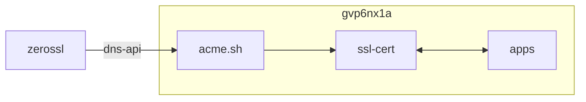

## container 구성

### .env
```sh
vi /opt/.acme/.env
```
```ini
DuckDNS_Token=b*******-****-*********-************
```

### zerossl 계정 등록
```sh
docker run -it --rm --name=acme --user=0:0 \
--env-file /opt/.acme/.env \
-e TZ=Asia/Seoul \
-v /opt/.acme:/acme.sh:rw \
neilpang/acme.sh:latest \
acme.sh --set-default-ca --register-account --server zerossl -m x*******-********@yahoo.com --eab-kid j********************* --eab-hmac-key D*************************************************************************************
```

### SSL 인증서 최초 발급
```sh
docker run -it --rm --name=acme --user=0:0 \
-e TZ=Asia/Seoul \
-v /opt/.acme:/acme.sh:rw \
neilpang/acme.sh:latest \
acme.sh --issue --dns dns_duckdns -d "$HOSTNAME.duckdns.org" --keylength ec-384 --force && \
docker run -it --rm --name=acme --user=0:0 \
-e TZ=Asia/Seoul \
-v /opt/.acme:/acme.sh:rw \
neilpang/acme.sh:latest \
acme.sh --issue --dns dns_duckdns -d "*.$HOSTNAME.duckdns.org" --keylength ec-384 --force
```

## host 구성

### crond [^1]
```sh
vi /home/dev/.local/bin/acme_cron.sh
```
```sh
#!/bin/bash
# acme.sh 인증서 갱신

source /home/dev/.bashrc
source /home/dev/.local/bin/utils.sh
log_file=/home/dev/.local/log/$(basename "$0" | sed 's/.sh//').log
msg_file=/home/dev/.local/log/$(basename "$0" | sed 's/.sh//').tmp

old_file_date=$(stat --printf="%y" \
  /opt/.acme/"$HOSTNAME".duckdns.org_ecc/fullchain.cer)
old_file_date=$(echo "$old_file_date" | cut -d ' ' -f1 | sed -E 's/-//g')
docker run \
  -i --rm --name=acme --network=dev --user=0:0 \
  --env-file=/opt/.acme/.env \
  -e TZ=Asia/Seoul \
  -v /opt/.acme:/acme.sh:rw \
  neilpang/acme.sh:latest \
  acme.sh --cron --debug > "$log_file"

skip_renew_msg="Skip.*Next renewal time is:.*"
if grep -qoE "$skip_renew_msg" "$log_file"; then
  cert_exp_date="$(date "+%Y%m%d" -d "$old_file_date 90 day")"
fi
total_period=$(get_valid_dates "$old_file_date" "$cert_exp_date" | wc -l)
current_period=$(get_valid_dates "$(date "+%Y%m%d")" "$cert_exp_date" | wc -l)
echo "old_file_date=$old_file_date"
echo "cert_exp_date=$cert_exp_date"
echo "total_period=$total_period"
echo "current_period=$current_period"
{ grep -oE "Your cert key is in:.*|The intermediate CA cert is in:.*|\
And the full chain certs is there:.*|$skip_renew_msg|Error.*" "$log_file"
  if grep -qoE "$skip_renew_msg" "$log_file"; then
    show_progress_bar "$current_period" "$total_period" "d"
  fi
} > "$msg_file"
send_tel_msg "$TEL_BOT_KEY" "$TEL_CHAT_ID" "$msg_file"
rm "$msg_file"
```

## License
상업적 이용 제한 없음
- GNU GPL v3 [^1]

[^1]: https://github.com/dntco43u/s6h7k8rv/blob/main/acme_cron.sh
[^2]: https://github.com/acmesh-official/acme.sh/blob/master/LICENSE.md
