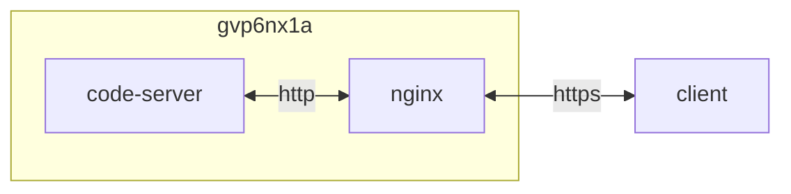

## container 구성

### .env
```sh
vi /opt/code-server/.env
```
```ini
PASSWORD=1***************************************************************
```

### docker-compose.yml [^1]
```sh
vi /opt/code-server/docker-compose.yml
```
```yml
services:
  code-server:
    image: lscr.io/linuxserver/code-server:4.16.1
    container_name: code-server
    networks:
      - dev
    ports:
      - 8443/tcp
    user: 0:0
    environment:
      - PUID=0
      - PGID=0
      - TZ=Asia/Seoul
      - PASSWORD=$PASSWORD
      - PROXY_DOMAIN=co.gvp6nx1a.duckdns.org
      - DEFAULT_WORKSPACE=/
    volumes:
      - /:/rootfs:rw
      - /opt/code-server/config:/config:rw
      - /opt/code-server/workbench/workbench.html:/usr/lib/code-server/lib/vscode/out/vs/code/browser/workbench/workbench.html:rw
      - /opt/code-server/font:/usr/lib/code-server/src/browser/pages/font:rw
    restart: unless-stopped
networks:
  dev:
    external: true
```

### 공통 구성
font D2Coding 구성
```sh
vi /opt/code-server/font/font.css
```
```css
@font-face {
  font-family: 'D2Coding';
  font-style: normal;
  font-weight: 400;
  font-display: swap;
  src: url('./d2coding-full.woff2') format('woff2');
}
@font-face {
  font-family: 'D2Coding';
  font-style: normal;
  font-weight: 700;
  font-display: swap;
  src: url('./d2coding-bold-full.woff2') format('woff2');
}
```
```sh
vi /opt/code-server/workbench/workbench.html
```
```html
...
            <head>
                <!-- custom-font -->
                <link rel="stylesheet" type="text/css" href={{BASE}}/"_static/src/browser/pages/font.css">
            </head>
...
```

## License
상업적 이용 제한 없음
- code-server: MIT [^2]
- D2Coding: OFL [^3]

## Troubleshpooting
{}
> log를 yyyymmdd* 형식의 폴더에 쌓는다 `/opt/code-server/config/data/logs/`

일일 스케줄링되는 [cleanup_disk.sh](https://dntco43u.github.io/infra/rhel9/#crond)에서 0일 이후 로그 삭제하도록 구성
{}

[^1]: codercom/code-server 이미지보다 linuxserver/code-server가 더 가볍다
[^2]: https://github.com/coder/code-server/blob/main/LICENSE
[^3]: https://github.com/naver/d2codingfont
