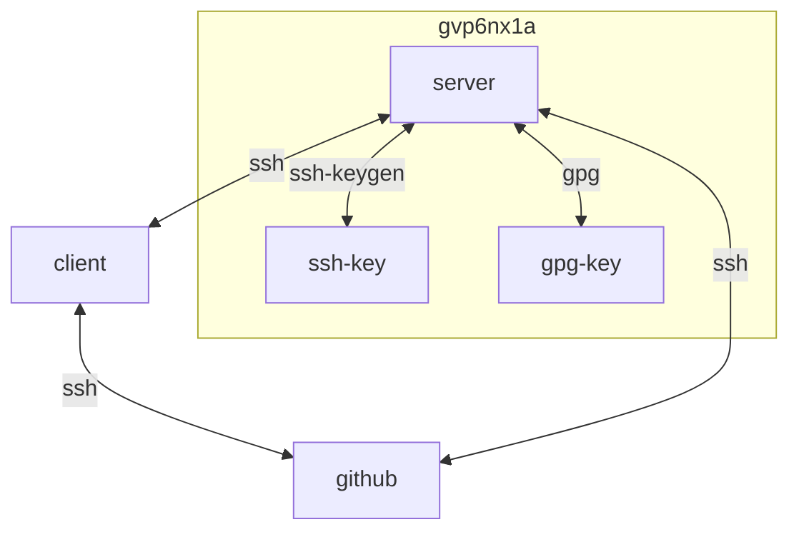

## key 구성

### ssh

키 생성
```sh
mkdir -p ~/ssh_keys && \
ssh-keygen -t ed25519 -P "" -C github-eddsa-key-$(date +%Y%m%d) -f ~/ssh_keys/dntco43u@github && \
mv ~/ssh_keys/dntco43u@github ~/ssh_keys/dntco43u@github.pem && \
cat ~/ssh_keys/dntco43u@github.pub && \
cat ~/ssh_keys/dntco43u@github.pem
```

클라이언트에 원본 키 다운로드
```sh
rclone copy -vv -P gvp6nx1a-ftp:/home/dev/ssh_keys $USERPROFILE/AppData/LocalLow/ssh_keys && \
git config --global user.name "dntco43u" && \
git config --global user.email "x*******-********@yahoo.com" && \
git config --global --add safe.directory '*' && \
eval "$(ssh-agent -s)" && \
ssh-add $USERPROFILE/AppData/LocalLow/ssh_keys/dntco43u@github.pem && \
ssh -T git@github.com
```
```
Hi dntco43u! You've successfully authenticated, but GitHub does not provide shell access.
```

서버에 원본 키 보관 (optional)
```sh
mv ~/ssh_keys/dntco43u@github.pem ~/.ssh && \
chmod 400 ~/.ssh/dntco43u@github.pem && \
sudo dnf update -y && sudo dnf install -y git && \
git config --global user.name "dntco43u" && \
git config --global user.email "x*******-********@yahoo.com" && \
git config --global --add safe.directory '*' && \
eval "$(ssh-agent -s)" && \
ssh-add ~/.ssh/dntco43u@github.pem && \
ssh -T git@github.com && \
rm -rf ~/ssh_keys
```

### gpg
키 생성
```sh
sudo dnf -y update && sudo dnf -y install pinentry && \
gpg --default-new-key-algo "ed25519/cert,sign+cv25519/encr" --gen-key
```
```
Real name::dntco43u
Email address:x*******-********@yahoo.com
```

```sh
gpg --list-keys
```
```
pub   ed25519 2024-06-03 [SC] [expires: 2026-06-03]
      E***************************************
uid           [ unknown] dntco43u <x*******-********@yahoo.com>
sub   cv25519 2024-06-03 [E] [expires: 2026-06-03]
```

```sh
mkdir -p ~/pgp_keys && \
gpg --output ~/pgp_keys/dntco43u@ec4mrjp5.pub --armor --export E*************************************** && \
gpg --output ~/pgp_keys/dntco43u@ec4mrjp5.key --armor --export-secret-key E***************************************
```

클라이언트에 복사 키 다운로드
```sh
rclone copy -vv -P gvp6nx1a-ftp:/home/dev/pgp_keys $USERPROFILE/AppData/LocalLow/pgp_keys && \
gpg --import $USERPROFILE/AppData/LocalLow/pgp_keys/dntco43u@ec4mrjp5.pub && \
gpg --import $USERPROFILE/AppData/LocalLow/pgp_keys/dntco43u@ec4mrjp5.key && \
echo "test" | gpg --clearsign
```

```sh
gpg --fingerprint && \
git config --global user.signingkey E*************************************** && \
git config --global commit.gpgsign true && \
ssh -T git@github.com
```
```
[keyboxd]
---------
pub   ed25519 2024-06-03 [SC] [expires: 2026-06-03]
      E*** **** **** **** **** ***** **** **** **** ****
uid           [ unknown] dntco43u <x*******-********@yahoo.com>
sub   cv25519 2024-06-03 [E] [expires: 2026-06-03]
```

```sh
touch testfile && \
git add . && git commit -m "Test gpg signature" && git push && \
rm testfile && \
git add . && git commit -m "Test gpg signature" && git push && \
git log --show-signature -1
```
```
commit 6*************************************** (HEAD -> main)
gpg: Signature made Sat Dec 13 20:09:52 2025 KST
gpg:                using EDDSA key E***************************************
gpg: Good signature from "dntco43u <x*******-********@yahoo.com>" [unknown]
gpg: WARNING: This key is not certified with a trusted signature!
gpg:          There is no indication that the signature belongs to the owner.
Primary key fingerprint: E*** **** **** **** **** ***** **** **** **** ****
Author: dntco43u <x*******-********@yahoo.com>
Date:   Sat Dec 13 20:09:52 2025 +0900

    Test gpg signature

```

서버에서 복사 키 삭제
```sh
rm -rf ~/pgp_keys
```

저장소 원본 키 삭제 (optional)
```sh
gpg --list-keys && gpg --list-secret-keys
```
```
[keyboxd]
---------
pub   ed25519 2024-06-03 [SC] [expires: 2026-06-03]
      E***************************************
uid           [ unknown] dntco43u <x*******-********@yahoo.com>
sub   cv25519 2024-06-03 [E] [expires: 2026-06-03]

[keyboxd]
---------
sec   ed25519 2024-06-03 [SC] [expires: 2026-06-03]
      E***************************************
uid           [ unknown] dntco43u <x*******-********@yahoo.com>
ssb   cv25519 2024-06-03 [E] [expires: 2026-06-03]
```

```sh
gpg --delete-secret-key E*************************************** && \
gpg --delete-key E***************************************
```

만료일 삭제 (optional)
```sh
gpg --quick-set-expire E*************************************** 0y && \
gpg --quick-set-expire E*************************************** 0y '*'
gpg --fingerprint
```
```
pub   ed25519 2024-06-03 [SC]
      E*** **** **** **** **** ***** **** **** **** ****
uid           [ unknown] dntco43u <x*******-********@yahoo.com>
sub   cv25519 2024-06-03 [E]
```

```sh
gpg --list-secret-keys --keyid-format=long
```
```
sec   ed25519/C*************** 2024-06-03 [SC]
      E***************************************
uid                 [ unknown] dntco43u <x*******-********@yahoo.com>
ssb   cv25519/E*************** 2024-06-03 [E]
```

```sh
gpg --keyserver keyserver.ubuntu.com --send-keys C***************
```

## windows 구성

### gitbash
```sh
vi ~/.bashrc
```
```ini
TITLEPREFIX=$(echo "$USERNAME"@"$COMPUTERNAME" | tr '[:upper:]' '[:lower:]')
cd ~/workspace
```


## License
상업적 이용 제한 없음
- git-for-windows: GNU GPL v2 [^1]
- D2Coding: OFL [^2]

## Troubleshooting
{}
> gitbash 환경 변수 참조
```sh
echo $APPDATA
```
{}

{}
> gitbash path 역슬래시 사용
```sh
ls '\\sj9n7air\d2'
```
{}

## References
- https://github.com/git-for-windows/git

[^1]: https://github.com/git-for-windows/git?tab=License-1-ov-file#readme
[^2]: https://github.com/naver/d2codingfont
