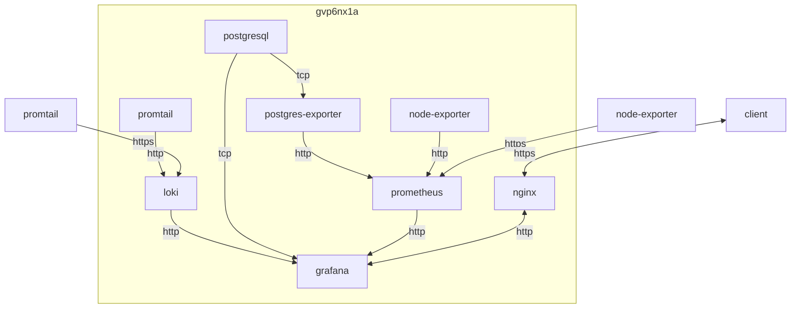

## container 구성

### docker-compose.yml
network bridge 구성이어도 host를 허용하도록 구성
```sh
vi /opt/grafana/docker-compose.yml
```
```yml
services:
  grafana:
    image: grafana/grafana:11.2.1
    container_name: grafana
    networks:
      - dev
    ports:
      - 3000/tcp
    extra_hosts:
      - "host.docker.internal:host-gateway"
    user: 0:0
    environment:
      - TZ=Asia/Seoul
    volumes:
      - /opt/grafana/config/grafana.ini:/etc/grafana/grafana.ini:rw
      - /opt/grafana/config/init_script.sh:/init_script.sh:rw
      - /opt/grafana/data:/var/lib/grafana:rw
    entrypoint: /init_script.sh
    restart: unless-stopped
networks:
  dev:
    external: true
```

### grafana 공통
변경할 구성 host에 mount
```sh
sudo docker cp grafana:/etc/grafana/grafana.ini /opt/grafana/config/grafana.ini
```

로그인 없이 view 허용 [^2]
```sh
vi /opt/grafana/config/grafana.ini
```
```ini
...
[auth.anonymous]
enabled = true
org_name = fhy8vp3u
org_role = Viewer
hide_version = false

[security]
cookie_samesite = lax
allow_embedding = true
...
```

## 데모 페이지

### nginx [^4]
nginx access 로그 시각화 (loki [^11] + promtail [^12])


[바로 가기](https://gr.gvp6nx1a.duckdns.org/d/T512JVH7a/nginx?orgId=1)

### logs [^5]
selinux, ssh, nginx access 로그 시각화 (loki [^11] + promtail [^12])


[바로 가기](https://gr.gvp6nx1a.duckdns.org/d/sadlil-loki-apps-dashboard/logs?orgId=1)

### postgres [^6]
postgresql DB 상태 시각화 (postgres-exporter [^13] + prometheus [^14])


[바로 가기](https://gr.gvp6nx1a.duckdns.org/d/00000003a/pgsql?orgId=1)

### ssh [^7]
ssh 로그 시각화 (loki [^11] + promtail [^12])


[바로 가기](https://gr.gvp6nx1a.duckdns.org/d/OMEuTfqVa/ssh?orgId=1)

### node-rhel [^8]
RHEL 메트릭 시각화 (node-exporter [^15] + prometheus [^14])


[바로 가기](https://gr.gvp6nx1a.duckdns.org/d/rYdddlPWa/node-rhel?orgId=1)

### node-owrt [^9]
openwrt 메트릭 시각화 (node-exporter-lua [^15] + prometheus [^14])


[바로 가기](https://gr.gvp6nx1a.duckdns.org/d/fLi0yXAWka/node-owrt?orgId=1)

## License
상업적 이용 제한 없음
- grafana v8+: AGPL v3 [^16]

## Troubleshooting
{}
> postgresql where 절 동적 sql 적용

variable 조건 중 다중 조건이 활성화되는 경우 IN 연산자 자동 적용
{}

{}
> 대시보드 초기화 시 dock menu 닫기

run.sh 실행 전에 init_script.sh를 먼저 실행하도록 변경 (docker-compose.yml)
```sh
vi /opt/grafana/config/init_script.sh
```
```sh
#!/bin/bash
find /usr/share/grafana/public/build -type f -name "*.js" | xargs sed -i 's/this.megaMenuDocked=\(!!\(.*\) xxl)),\)/this.megaMenuDocked=false,/g'
bash -c /run.sh
```
```sh
chmod 755 /opt/grafana/config/init_script.sh && \
chown dev:dev /opt/grafana/config/init_script.sh
```
{}

{}
> SQLite database file has broader permissions than it should [^10]

```sh
docker exec -it grafana chmod 640 /var/lib/grafana/grafana.db
```
{}

{}
> Skipping finding plugins as directory does not exist

```sh
docker exec -it grafana mkdir -p /usr/share/grafana/plugins-bundled
```
{}

{}
> The Dashboards has been changed by someone else

버전 충돌. 최신 버전으로 재작업 혹은 json 최하단의 version을 현재 version과 맞춰 저장 [^3]
{}

[^2]: https://community.grafana.com/t/public-dashboard-grafana-in-external-link-without-login-tutorial/59221/6
[^3]: https://community.grafana.com/t/recurrent-issue-the-dashboards-has-been-changed-by-someone-else/41349/9
[^4]: https://grafana.com/grafana/dashboards/13865-fgc-nginx01-web-analytics/
[^5]: https://grafana.com/grafana/dashboards/13359-logs/
[^6]: https://grafana.com/grafana/dashboards/9628-postgresql-database/
[^7]: https://grafana.com/grafana/dashboards/17514-ssh-logs/
[^8]: https://grafana.com/grafana/dashboards/12486-node-exporter-full/
[^9]: https://grafana.com/grafana/dashboards/11147-openwrt/
[^10]: https://community.grafana.com/t/migration-from-grafana-7-4-2-to-7-4-3/44525
[^11]: https://dntco43u.github.io/apps/loki/#local-configyaml-1
[^12]: https://dntco43u.github.io/apps/promtail/#configyml
[^13]: https://dntco43u.github.io/apps/pgsql-exporter/
[^14]: https://dntco43u.github.io/apps/prometheus/#%EC%9D%BC%EB%B0%98-%EA%B5%AC%EC%84%B1
[^15]: https://dntco43u.github.io/apps/node-exporter/
[^16]: https://grafana.com/licensing/
