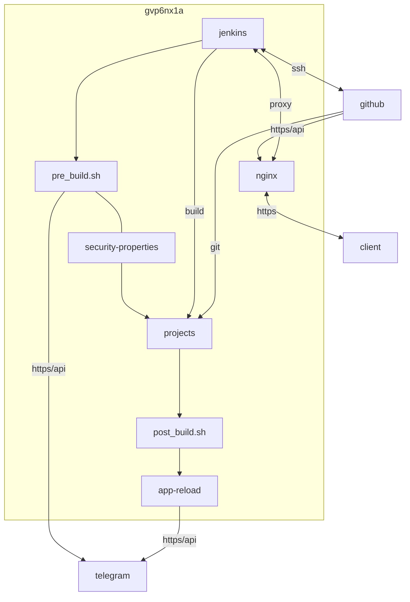

## container 구성

### docker-compose.yml
- 이미지 크기: latest-jdk17 279.13 MB, alpine-jdk17 193.04 MB
- alpine-jdk17 x86 전용. arm 사용 불가
```sh
vi /opt/jenkins/docker-compose.yml
```
```yml
services:
  jenkins:
    image: jenkins/jenkins:jdk17
    container_name: jenkins
    networks:
      - dev
    ports:
      - 8080/tcp
    user: 1000:1000
    environment:
      - JAVA_OPTS=-Xmx1g
      - TZ=Asia/Seoul
    volumes:
      - /home/dev/.local/bin/utils.sh:/var/jenkins_home/config/utils.sh:ro
      - /opt/jenkins/data:/var/jenkins_home:rw
    restart: unless-stopped
networks:
  dev:
    external: true
```

### 초기 암호
```sh
docker exec -it jenkins cat /var/jenkins_home/secrets/initialAdminPassword
```
```
3*******************************
```

### github ssh
```sh
docker cp /home/dev/.ssh/dntco43u@github.pub jenkins:/var/jenkins_home/.ssh/id_ed25519.pub && \
docker cp /home/dev/.ssh/dntco43u@github.pem jenkins:/var/jenkins_home/.ssh/id_ed25519 && \
docker exec -it jenkins ssh -T git@github.com
```
```
Hi dntco43u! You've successfully authenticated, but GitHub does not provide shell access.
```

### github webooks


### pre_build.sh
- 빌드 전처리
- 각 프로젝트 보안 환경 구성 `/opt/jenkins/data/config/$PROJECT_NAME/application-security.properties`
```sh
vi /opt/jenkins/data/config/pre_build.sh
```
```sh
#!/bin/bash
# 자동 build 전 처리

source /var/jenkins_home/config/utils.sh
log_file=/tmp/$(basename "$0" | sed 's/.sh//').log
msg_file=/tmp/$(basename "$0" | sed 's/.sh//').tmp

jenkins_bot_key="$3"
tel_chat_id="$4"
{ echo "$1 #$2"
  mkdir -p "/var/jenkins_home/workspace/$1/src/main/resources"
  cp -f \
    "/var/jenkins_home/config/$1/application-security.properties" \
    "/var/jenkins_home/workspace/$1/src/main/resources"
  show_file_stat "/var/jenkins_home/workspace/$1/src/main/resources/application-security.properties"
} > "$log_file"
cp "$log_file" "$msg_file"
send_tel_msg "$jenkins_bot_key" "$tel_chat_id" "$msg_file"
rm "$msg_file"
```

### post_build.sh
- 빌드 후처리
- 각 프로젝트에 첨부

### telegram


## License
상업적 이용 제한 없음
- MIT [^1]

## Troubleshooting
{}
> 열약한 기기에서 설치 도중 멈춤

메모리 부족일 때 그렇다고 한다. 환경 변수 JAVA_OPTS=-Xmx1g 추가 (docker-compose.yml)
{}

{}
> src 수정없이 security properties만 수정하면 jar 미반영됨

src 수정 후 rebuild 되는 것 확인할 것
{}

{}
> 

proxy에서 국외 ip 차단 시 webhook 차단됨
{}

[^1]: https://www.jenkins.io/license/
