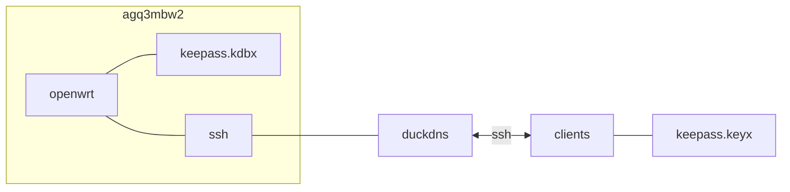

## openwrt 구성

### 포트 개방
```sh
vi /etc/config/firewall
```
```conf
...
config redirect
	option dest 'lan'
	option target 'DNAT'
	option name 'agq3mbw2-ssh'
	option src 'wan'
	option dest_port '22'
	list proto 'tcp'
	option dest_ip '192.168.192.1'
	option family 'ipv4'
	option src_dport '5****'
...
```
```sh
/etc/init.d/firewall restart
```

### 계정 추가

  {}
  {}
```sh
echo "dev:x:1000:1000:dev:/home/dev:/bin/ash"  >> /etc/passwd && \
echo "dev:x:1000:dev" >> /etc/group && \
echo "dev:19073:0:99999:7:::" >> /etc/shadow && \
passwd dev
_***************************************************************

mkdir -p /home/dev/.ssh && \
echo "ssh-ed25519 A******************************************************************* agq3mbw2-eddsa-key-20230927
" | sudo tee /home/dev/.ssh/authorized_keys && \
chmod 755 /home && \
chmod 755 /home/dev && \
chmod 700 /home/dev/.ssh && \
chmod 600 /home/dev/.ssh/authorized_keys && \
chown -R dev:dev /home/dev
```
  {}

  {}
```sh
echo "vscp5ekq:x:1001:1000:vscp5ekq:/home/vscp5ekq:/bin/ash"  >> /etc/passwd && \
echo "agq3mbw2:x:1000:vscp5ekq" >> /etc/group && \
echo "vscp5ekq:.:0:0:99999:7:::" >> /etc/shadow && \
passwd vscp5ekq
Z***************************************************************

mkdir -p /home/vscp5ekq/.ssh && \
echo "ssh-rsa A*****************************************************************************************************************************************************************************************************************************************************************************************************************************************************************************************************************************************************************************************************************************************************************************************************************************************************************************************************************************************== generated by Keepass2Android
" | sudo tee /home/vscp5ekq/.ssh/authorized_keys && \
chmod 755 /home && \
chmod 755 /home/vscp5ekq && \
chmod 700 /home/vscp5ekq/.ssh && \
chmod 600 /home/vscp5ekq/.ssh/authorized_keys && \
chown -R vscp5ekq:dev /home/vscp5ekq
```
  


### dropbear
```sh
cat << EOF | tee /etc/config/dropbear
config dropbear
        option Port '22'
        option PasswordAuth 'off'
        option RootPasswordAuth 'off'
        option GatewayPorts 'on'
EOF
```

```sh
/etc/init.d/dropbear restart
```

### 패키지 설치
```sh
opkg update && \
opkg install luci-app-ddns drill curl openssh-sftp-server
```

### ddns
```sh
vi /etc/config/ddns
```
```conf
config ddns 'global'
	option ddns_dateformat '%F %R'
	option ddns_loglines '250'
	option ddns_rundir '/var/run/ddns'
	option ddns_logdir '/var/log/ddns'
	option use_curl '1'

config service 'duckdns'
	option service_name 'duckdns.org'
	option use_ipv6 '0'
	option enabled '1'
	option password 'b*******-****-****-****-************'
	option use_https '1'
	option ip_source 'network'
	option ip_network 'wan'
	option interface 'wan'
	option use_syslog '2'
	option check_unit 'minutes'
	option force_unit 'minutes'
	option retry_unit 'seconds'
	option param_enc 'https://www.duckdns.org/update?domains=agq3mbw2&token=b*******-****-****-****-************'
	option cacert '/etc/ssl/certs/ca-certificates.crt'
	option lookup_host 'sj9n7air.duckdns.org'
	option domain 'sj9n7air.duckdns.org'
	option username 'sj9n7air'
```

```sh
/etc/init.d/ddns restart
```

### db 권한
```sh
chown dev:dev -R /usr/share/keepass && \
chmod 770 /usr/share/keepass && \
chmod 660 /usr/share/keepass/fhy8vp3u.kdbx
```

## windows 구성

### KeePass.config.xml
```sh
vi $APPDATA/KeePass/KeePass.config.xml
```
```xml
...
<DatabasePath>sftp://sj9n7air.duckdns.org:5****/usr/share/keepass/fhy8vp3u.kdbx</DatabasePath>
<KeyFilePath>..\..\Users\dev\AppData\Roaming\KeePass\fhy8vp3u.keyx</KeyFilePath>
...
```


## License
상업적 이용 제한 없음
- keepass: GNU GPL [^2]
- D2Coding: OFL [^3]

## Troubleshooting
{}
> android 버전은 ssh키를 앱에서 관리하고 외부키를 사용할 수 없음 [^1]

각 클라이언트별 계정 생성 외에는 방법이 없다
{}

## References
- https://www.duckdns.org/install.jsp#openwrt


[^1]: 최신 버전은 가능하다고 함 (구버전 해당 없음) https://github.com/PhilippC/keepass2android/issues/2009
[^2]: https://keepass.info/help/v2/license.html
[^3]: https://github.com/naver/d2codingfont
