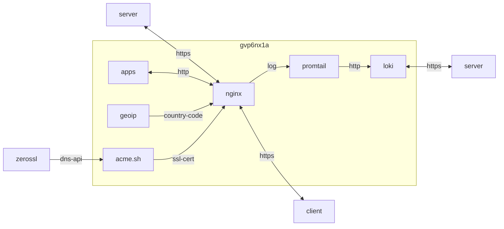

## container 구성

### Dockerfile
```sh
vi /opt/nginx/Dockerfile
```
```dockerfile
FROM nginx:alpine-slim AS builder
RUN apk update && \
    apk add --no-cache --virtual .build-deps \
    gcc \
    geoip-dev \
    git \
    libc-dev \
    libmaxminddb \
    libmaxminddb-dev \
    make \
    openssl-dev \
    pcre-dev \
    python3-dev \
    py3-pip \
    zlib-dev && \
    rm -rf /var/cache/apk/*
WORKDIR /usr/local
RUN git clone https://github.com/leev/ngx_http_geoip2_module.git --depth=1
RUN wget http://nginx.org/download/nginx-${NGINX_VERSION}.tar.gz && \
    mkdir -p /usr/src && \
    tar -zxC /usr/src -f nginx-${NGINX_VERSION}.tar.gz
RUN CONFARGS=$(nginx -V 2>&1 | sed -n -e 's/^.*arguments: //p') \
    cd /usr/src/nginx-$NGINX_VERSION && \
    ./configure --with-compat $CONFARGS \
    --add-dynamic-module=/usr/local/ngx_http_geoip2_module/ && \
    make && \
    make modules && \
    make install && \
    mkdir -p /usr/local/nginx/modules/
FROM nginx:alpine-slim
COPY --from=builder /usr/local/nginx/modules/ngx_http_geoip2_module.so /usr/lib/nginx/modules/ngx_http_geoip2_module.so
RUN apk update && \
    apk add --no-cache \
    libmaxminddb \
    openssl && \
    rm -rf /var/cache/apk/*
```
```sh
docker build -t e7hnr8ov/nginx:alpine /opt/nginx
```

### docker-compose.yml
network bridge 구성이어도 host를 허용하도록 구성
```sh
vi /opt/nginx/docker-compose.yml
```
```yml
services:
  nginx:
    image: e7hnr8ov/nginx:alpine
    container_name: nginx
    networks:
      - dev
    ports:
      - 80:80/tcp
      - 443:443/tcp
    extra_hosts:
      - "host.docker.internal:host-gateway"
    user: 0:0
    environment:
      - TZ=Asia/Seoul
    volumes:
      - /opt/nginx/config:/etc/nginx:rw
      - /opt/nginx/ssl/dhparam.pem:/etc/ssl/dhparam.pem:ro
      - /opt/nginx/ssl/openssl.cnf:/etc/ssl/openssl.cnf:ro
      - /opt/nginx/webroot:/usr/share/nginx/html:ro
      - /opt/nginx/log:/var/log/nginx:rw
      - /opt/geoipupdate/data:/usr/share/geoip:ro
      - /opt/.acme/*.$HOSTNAME.duckdns.org_ecc/fullchain.cer:/etc/ssl/*.$HOSTNAME.duckdns.org/fullchain.pem:ro
      - /opt/.acme/*.$HOSTNAME.duckdns.org_ecc/*.$HOSTNAME.duckdns.org.key:/etc/ssl/*.$HOSTNAME.duckdns.org/privkey.pem:ro
    restart: unless-stopped
networks:
  dev:
    external: true
```

### openssl
openssl 암호 정책과 dhparam.pem 생성
```sh
sudo docker cp nginx:/etc/ssl/openssl.cnf /opt/nginx/ssl/openssl.cnf && \
sudo openssl dhparam -out ~/dhparam1.pem 4096 && \
sudo mv ~/dhparam1.pem /opt/nginx/ssl/dhparam.pem
```
```sh
vi /opt/nginx/ssl/openssl.cnf
```
```ini
[default_conf]
ssl_conf = ssl_sect

[ssl_sect]
system_default = system_default_sect

[system_default_sect]
MinProtocol = TLSv1.2
#CipherString = DEFAULT@SECLEVEL=2
Ciphersuites = TLS_AES_256_GCM_SHA384
CipherString = ECDHE-RSA-AES256-GCM-SHA384:ECDHE-RSA-CHACHA20-POLY1305:ECDHE-ARIA256-GCM-SHA384
```

### *.conf
변경할 구성 host에 mount
```sh
sudo docker cp nginx:/etc/nginx /opt/nginx/config && \
chown dev:dev -R /opt/nginx
```

모듈, 사용자 구성 참조. 수집 데이터 활용을 위해 json log 구성
```sh
/opt/nginx/config/nginx.conf
```
```conf
# Load modules
include /etc/nginx/modules-enabled/*.conf;
...
  log_format json escape=json '{'
    '"msec": "$msec", '
    '"connection": "$connection", '
    '"connection_requests": "$connection_requests", '
    '"pid": "$pid", '
    '"request_id": "$request_id", '
    '"request_length": "$request_length", '
    '"remote_addr": "$remote_addr", '
    '"remote_user": "$remote_user", '
    '"remote_port": "$remote_port", '
    '"time_local": "$time_local", '
    '"time_iso8601": "$time_iso8601", '
    '"request": "$request", '
    '"request_uri": "$request_uri", '
    '"args": "$args", '
    '"status": "$status", '
    '"body_bytes_sent": "$body_bytes_sent", '
    '"bytes_sent": "$bytes_sent", '
    '"http_referer": "$http_referer", '
    '"http_user_agent": "$http_user_agent", '
    '"http_x_forwarded_for": "$http_x_forwarded_for", '
    '"http_host": "$http_host", '
    '"server_name": "$server_name", '
    '"request_time": "$request_time", '
    '"upstream": "$upstream_addr", '
    '"upstream_connect_time": "$upstream_connect_time", '
    '"upstream_header_time": "$upstream_header_time", '
    '"upstream_response_time": "$upstream_response_time", '
    '"upstream_response_length": "$upstream_response_length", '
    '"upstream_cache_status": "$upstream_cache_status", '
    '"ssl_protocol": "$ssl_protocol", '
    '"ssl_cipher": "$ssl_cipher", '
    '"scheme": "$scheme", '
    '"request_method": "$request_method", '
    '"server_protocol": "$server_protocol", '
    '"pipe": "$pipe", '
    '"gzip_ratio": "$gzip_ratio", '
    '"http_cf_ray": "$http_cf_ray",'
    '"geoip_country_code": "$geoip2_data_country_code"'
  '}';
  access_log /var/log/nginx/_access.log json buffer=64k flush=10s;
  error_log  /var/log/nginx/_error.log  warn;
...
  # Load configs
  include /etc/nginx/conf.d/*.conf;
  include /etc/nginx/sites-enabled/*.conf;
...
```

```sh
/opt/nginx/config/conf.d/default.conf
```
```conf
server {
  listen      80 default_server;
  server_name _;
  return      301 https://$host$request_uri;
}

server {
	listen               443 ssl default_server;
  http2                on;
  server_name          _;
  set $forward_scheme  https;
  set $server          127.0.0.1;
  set $port            443;
  ssl_reject_handshake on;

  # Custom SSL
  ssl_certificate     /etc/ssl/*.gvp6nx1a.duckdns.org/fullchain.pem;
  ssl_certificate_key /etc/ssl/*.gvp6nx1a.duckdns.org/privkey.pem;

  # SSL
  include /etc/nginx/conf.d/include/force-ssl.conf;

  # nginxconfig.io
  include /etc/nginx/conf.d/include/security.conf;
  include /etc/nginx/conf.d/include/general.conf;

  # Block Exploits
  include /etc/nginx/conf.d/include/block-exploits.conf;

  # error pages
  include /usr/share/nginx/html/nginx-errors/nginx-errors.conf;

  # logging
  access_log /var/log/nginx/fallback_access.log json buffer=64k flush=10s;
  error_log  /dev/null                          crit;

  return 444;
}

server {
  listen      80;
  server_name localhost 127.0.0.1 172.18.0.3;

  location /nginx_status {
    stub_status on;
    access_log  off;
    allow       127.0.0.1;
    allow       172.16.0.0/12;
    deny        all;
  }

  location /print_args {
    include     /etc/nginx/snippets/print-args.conf;
    access_log  off;
    allow       127.0.0.1;
    allow       172.16.0.0/12;
    deny        all;
  }
}
```

디버그
```sh
vi /opt/nginx/config/snippets/print-args.conf
```
```conf
add_header Content-Type text/plain;
add_header print-NGINX-uri $uri;
return 200
"arg_name: $arg_name
args: $args
uri:$uri
content_length: $content_length
content_type: $content_type
document_root: $document_root
document_uri: $document_uri
host: $host
host_name: $hostname
http_name: $http_name
https: $https
is_args: $is_args
nginx_version: $nginx_version
pid: $pid
query_string: $query_string
real_ip: $remote_addr
forwarded_for: $proxy_add_x_forwarded_for
request: $request
request_method: $request_method
server_name: $server_name
server_port: $server_port
server_protocol: $server_protocol
status: $status
time_local: $time_local
geoip2_data_country_code: $geoip2_data_country_code";
```

해외 ip 차단
```sh
/opt/nginx/config/conf.d/geoip.conf
```
```conf
geoip2 /usr/share/geoip/GeoLite2-Country.mmdb {
  $geoip2_data_country_code country iso_code;
}

fastcgi_param COUNTRY_CODE $geoip2_data_country_code;
add_header X-Country-Code "$geoip2_data_country_code" always;

map $geoip2_data_country_code $allowed_country {
  default no;
  '' yes; #lan ip
  KR yes;
}
```

봇 차단
```sh
/opt/nginx/config/conf.d/include/block-exploits.conf
```
```conf
...
# Blcok bots
if ($http_user_agent ~* (AhrefsBot|BLEXBot|DotBot|SemrushBot|Eyeotabot|PetalBot|MJ12bot|brands-bot|bbot|AhrefsBo|MegaIndex|UCBrowser|Mb2345Browser|MicroMessenger|LieBaoFast|Headless|netEstate|newspaper|Adsbot/3.1|WordPress/|ltx71) ) {
  return 403;
}

location /robots.txt {
  return 200 "User-agent: *\nDisallow: /";
}
```

ssl 정책
```sh
/opt/nginx/config/conf.d/include/force-ssl.conf
```
```conf
# SSL
ssl_session_timeout       1d;
ssl_session_cache         shared:MozSSL:10m;
ssl_session_tickets       off;
ssl_prefer_server_ciphers off;

# OCSP Stapling
ssl_stapling        on;
ssl_stapling_verify on;
resolver            127.0.0.11 1.1.1.1 1.0.0.1 valid=60s;
resolver_timeout    2s;

# ssllabs
ssl_protocols TLSv1.2 TLSv1.3;
ssl_ciphers ECDHE-ECDSA-AES256-GCM-SHA384:ECDHE-RSA-AES256-GCM-SHA384:ECDHE-ECDSA-CHACHA20-POLY1305:ECDHE-RSA-CHACHA20-POLY1305:ECDHE-ARIA256-GCM-SHA384:DHE-RSA-AES256-GCM-SHA384;
ssl_ecdh_curve X448:secp521r1:secp384r1;

# Diffie-Hellman parameter for DHE ciphersuites
ssl_dhparam /etc/ssl/dhparam.pem;
```

gzip으로 정적 파일 응답 속도 개선
```sh
/opt/nginx/config/conf.d/include/general.conf
```
```conf
...
# gzip
gzip            on;
gzip_vary       on;
gzip_proxied    any;
gzip_comp_level 6;
gzip_types      text/plain text/css text/xml application/json application/javascript application/rss+xml application/atom+xml image/svg+xml;
```

proxy 일반
```sh
/opt/nginx/config/conf.d/include/proxy.conf
```
```conf
proxy_http_version 1.1;

# Proxy SSL
proxy_ssl_server_name on;

# Proxy headers
proxy_set_header Host                 $host;
proxy_set_header Upgrade              $http_upgrade;
proxy_set_header Connection           $connection_upgrade;
proxy_set_header X-Real-IP            $remote_addr;
proxy_set_header Forwarded            $proxy_add_forwarded;
proxy_set_header X-Forwarded-For      $proxy_add_x_forwarded_for;
proxy_set_header X-Forwarded-Proto    $scheme;
proxy_set_header X-Forwarded-Protocol $scheme;
proxy_set_header X-Forwarded-Host     $host;
proxy_set_header X-Forwarded-Port     $server_port;
proxy_set_header Connection           "";

# Proxy timeouts
proxy_connect_timeout 180s;
proxy_send_timeout    180s;
proxy_read_timeout    180s;

# nginx-proxy-manager
#add_header       X-Served-By        $host;
#roxy_set_header  X-Forwarded-Scheme $scheme;
#proxy_set_header X-Forwarded-By     $server_addr:$server_port;

# HSTS (ngx_http_headers_module is required) (63072000 seconds = 2 years)
add_header Strict-Transport-Security "max-age=63072000; includeSubDomains; preload" always;
```

보안 정책과 HSTS
```sh
/opt/nginx/config/conf.d/include/security.conf
```
```conf
# security headers
add_header X-XSS-Protection          "1; mode=block" always;
add_header X-Content-Type-Options    "nosniff" always;
add_header Referrer-Policy           "no-referrer-when-downgrade" always;
add_header Content-Security-Policy   "default-src 'self' http: https: ws: wss: data: blob: 'unsafe-inline'; frame-ancestors 'self';" always;
add_header Permissions-Policy        "interest-cohort=()" always;

# HSTS (ngx_http_headers_module is required) (63072000 seconds = 2 years)
add_header Strict-Transport-Security "max-age=63072000; includeSubDomains; preload" always;

# wiki
add_header X-Frame-Options SAMEORIGIN;
add_header X-Robots-Tag    none;

# files
location ~ /\.(?!well-known) {
  deny all;
}
```

### site 예제
```sh
/opt/nginx/config/sites-available/portainer.conf
```
```conf
server {
  listen      80;
  return      301 https://po.gvp6nx1a.duckdns.org$request_uri;
  server_name po.gvp6nx1a.duckdns.org;
}

server {
  listen      443 ssl;
  http2       on;
  server_name po.gvp6nx1a.duckdns.org;

  # reverse proxy
  location / {
    if ($allowed_country = no) {
      return 403;
    }
    include    /etc/nginx/conf.d/include/proxy.conf;
    proxy_pass https://portainer:9443;
  }

  # Custom SSL
  ssl_certificate     /etc/ssl/*.gvp6nx1a.duckdns.org/fullchain.pem;
  ssl_certificate_key /etc/ssl/*.gvp6nx1a.duckdns.org/privkey.pem;

  # SSL
  include /etc/nginx/conf.d/include/force-ssl.conf;

  # nginxconfig.io
  include /etc/nginx/conf.d/include/security.conf;
  include /etc/nginx/conf.d/include/general.conf;

  # Block Exploits
  include /etc/nginx/conf.d/include/block-exploits.conf;

  # error pages
  include /usr/share/nginx/html/nginx-errors/nginx-errors.conf;

  # logging
  access_log /var/log/nginx/portainer_access.log json buffer=64k flush=10s;
  error_log  /var/log/nginx/portainer_error.log  warn;
}
```

### site 추가
```sh
docker exec -it nginx find /etc/nginx/sites-enabled/ -name "*.conf" -exec unlink {} \;
docker exec -it nginx find /etc/nginx/sites-available/ -name "*.conf" -exec ln -s {} /etc/nginx/sites-enabled/ \;
docker exec -it nginx nginx -t && docker exec -it nginx nginx -s reload
```

### error page [^4]
한글화 (optional)
```sh
cd /opt/nginx/webroot && \
git clone https://github.com/bartosjiri/nginx-errors.git && \
find /opt/nginx/webroot -name ".git*" -exec rm -rf {} \;
```


## host 구성

### port 개방
```sh
sudo firewall-cmd --permanent --add-port={80,443}/tcp && \
sudo firewall-cmd --reload && \
sudo firewall-cmd --list-all
```

### crond [^2] [^3]
```sh
vi ~/.local/bin/update_cfip.sh
```
```sh
#!/bin/bash
# cloudflare ip 갱신

source /home/dev/.bashrc
source /home/dev/.local/bin/utils.sh
log_file=/home/dev/.local/log/$(basename "$0" | sed 's/.sh//').log
msg_file=/home/dev/.local/log/$(basename "$0" | sed 's/.sh//').tmp

{ echo "# Cloudflare real ip" \
    > /opt/nginx/config/conf.d/include/ip-ranges.conf
  for i in $(curl -s -L https://www.cloudflare.com/ips-v4); do
    echo "set_real_ip_from $i;" \
      >> /opt/nginx/config/conf.d/include/ip-ranges.conf
  done
  for i in $(curl -s -L https://www.cloudflare.com/ips-v6); do
    echo "set_real_ip_from $i;" \
      >> /opt/nginx/config/conf.d/include/ip-ranges.conf
  done
} > "$log_file"
show_file_stat /opt/nginx/config/conf.d/include/ip-ranges.conf > "$msg_file"
send_tel_msg "$TEL_BOT_KEY" "$TEL_CHAT_ID" "$msg_file"
rm "$msg_file"
```
```sh
vi /opt/geoipupdate/.env
```
```ini
GEOIPUPDATE_ACCOUNT_ID=9*****
GEOIPUPDATE_LICENSE_KEY=S***************************************
```
```sh
vi ~/.local/bin/update_geoip.sh
```
```sh
#!/bin/bash
# geoip2 데이터베이스 갱신

source /home/dev/.bashrc
source /home/dev/.local/bin/utils.sh
log_file=/home/dev/.local/log/$(basename "$0" | sed 's/.sh//').log
msg_file=/home/dev/.local/log/$(basename "$0" | sed 's/.sh//').tmp

docker run \
  -i --rm --name=geoipupdate --network=dev --user=0:0 \
  --env-file /opt/geoipupdate/.env \
  -e GEOIPUPDATE_EDITION_IDS="GeoLite2-Country" \
  -v /opt/geoipupdate/data:/usr/share/GeoIP:rw \
  maxmindinc/geoipupdate:latest > "$log_file"
show_file_stat /opt/geoipupdate/data/GeoLite2-Country.mmdb > "$msg_file"
send_tel_msg "$TEL_BOT_KEY" "$TEL_CHAT_ID" "$msg_file"
rm "$msg_file"
```

### logrotate
```sh
sudo vi /etc/logrotate.d/nginx
```
```propertiies
/opt/nginx/log/*.log {
  daily
  rotate 7
  missingok
  notifempty
  dateext
  dateyesterday
  dateformat -%Y%m%d
  nocompress
  create 0664 dev dev
  sharedscripts
  postrotate
    docker exec nginx nginx -s reload >/dev/null 2>&1 || true
    docker restart promtail >/dev/null 2>&1 || true
  endscript
}
```

## 테스트
openssl 구성 확인
```sh
docker exec -it nginx openssl version && docker exec -it nginx openssl ciphers -v
```
ocsp 테스트
```sh
docker exec -i nginx openssl s_client -connect hu.gvp6nx1a.duckdns.org:443 -status < /dev/null
```
cbc 암호 거부 테스트
```sh
docker exec -it nginx openssl s_client -connect  hu.gvp6nx1a.duckdns.org:443 -cipher ECDHE-ECDSA-AES128-SHA256 -tls1_2
```
renegotiating 거부 테스트 (/opt/nginx/ssl/openssl.cnf unmount 후 테스트)
```sh
docker exec -it nginx openssl s_client -connect hu.gvp6nx1a.duckdns.org:443 -tls1_2
```
bot 거부 테스트
```sh
curl -I --user-agent "Mozilla/5.0 (compatible; SemrushBot/7~b|; +http://www.semrush.com/bot.html)" https://po.gvp6nx1a.duckdns.org
```

높은 점수 달성을 위한 구성
- [x] EC 384 bits 인증서
- [x] HTTP Strict Transport Security 구성 (security.conf)
- [x] OCSP Stapling 구성 (force-ssl.conf)
- [x] DHE ciphersuites 구성 (force-ssl.conf)
- [x] 취약성 없는 암호화 방식으로만 구성 (force-ssl.conf, openssl.cnf)


[바로 가기](https://www.ssllabs.com/ssltest/analyze.html?d=hu.gvp6nx1a.duckdns.org&hideResults=on)


[바로 가기](https://www.immuniweb.com/ssl/hu.gvp6nx1a.duckdns.org/)

## License
상업적 이용 제한 없음
- nginx(not plus): BSD 2-Clause [^5]

## Troubleshooting
{}
> webdav TLS 1.3 구성 실패

TLS 1.2 호환되도록 구성
{}

{}
> TLS_CHACHA20_POLY1305_SHA256 암호화 비권장 구성 (www.immuniweb.com)

구성 삭제
{}

{}
> Error response from daemon: driver failed programming external connectivity on endpoint nginx (2c91db9c75e735c2de08cf071208da8b56b0f61c9472c2deb382da08a622dc43):  (COMMAND_FAILED: '/usr/sbin/iptables -w10 -t nat -A DOCKER -p tcp -d 0/0 --dport 443 -j DNAT --to-destination 172.18.0.3:443 ! -i br-d77060f818ff' failed: iptables: No chain/target/match by that name.

```sh
sudo service docker restart
```
{}

## References
- https://ssl-config.mozilla.org/#server=nginx&version=1.27.3&config=modern&openssl=3.4.0&guideline=5.7
- https://www.getpagespeed.com/server-setup/nginx/tuning-proxy_buffer_size-in-nginx
- https://www.digitalocean.com/community/tools/nginx?global.https.sslProfile=modern
- https://www.ssllabs.com/
- https://www.immuniweb.com/ssl/

[^1]: https://gr.gvp6nx1a.duckdns.org/d/T512JVH7a/nginx?orgId=1
[^2]: https://github.com/dntco43u/s6h7k8rv/blob/main/update_cfip.sh
[^3]: https://github.com/dntco43u/s6h7k8rv/blob/main/update_geoip.sh
[^4]: https://github.com/bartosjiri/nginx-errors.git
[^5]: https://nginx.org/LICENSE
