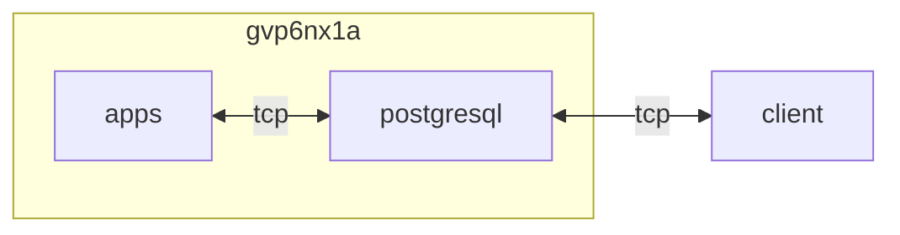

## host 구성

### 사설 인증서로 외부 접속 개방
```sh
sudo rm -rf /var/lib/pgsql && \
sudo dnf -y update && \
sudo dnf module remove -y postgresql:16/server && \
sudo dnf module install -y postgresql:16/server && \
sudo postgresql-setup --initdb
```

```sh
sudo vi /var/lib/pgsql/data/pg_hba.conf
```
```ini
...
# "local" is for Unix domain socket connections only
local   all             all                                     trust
# IPv4 local connections:
host    all             all             127.0.0.1/32            trust
# IPv6 local connections:
host    all             all             ::1/128                 trust
# Allow replication connections from localhost, by a user with the
# replication privilege.
local   replication     all                                     trust
host    replication     all             127.0.0.1/32            trust
host    replication     all             ::1/128                 trust

host    all             all             all                     scram-sha-256
```

```sh
sudo vi /var/lib/pgsql/data/postgresql.conf
```
```ini
...
# - Connection Settings -
listen_addresses = '*'

# - Authentication -
password_encryption = scram-sha-256

# - SSL -
ssl = on
ssl_cert_file = '/var/lib/pgsql/server.crt'
ssl_key_file =  '/var/lib/pgsql/server.key'
ssl_ciphers = ' ECDHE-ECDSA-AES256-GCM-SHA384:ECDHE-RSA-AES256-GCM-SHA384:ECDHE-ECDSA-CHACHA20-POLY1305:ECDHE-RSA-CHACHA20-POLY1305:ECDHE-ARIA256-GCM-SHA384:DHE-RSA-AES256-GCM-SHA384'
ssl_ecdh_curve = 'X448:secp521r1:secp384r1'
ssl_min_protocol_version = 'TLSv1.2'
ssl_dh_params_file = '/opt/nginx/ssl/dhparam.pem'
...
```

```sh
cd /usr/share/pki/ca-trust-source/anchors && \
sudo openssl req -new -x509 -nodes -text -out server.crt \
  -keyout server.key -subj '/C=KR/ST=Seoul/L=Jungnang/O=fhy8vp3u/OU=dev/CN=fhy8vp3u/emailAddress=x*******-********@yahoo.com' && \
sudo openssl x509 -in server.crt -noout -dates && \
sudo chown dev:dev server.{key,crt} && \
sudo chmod 0400 server.key && \
sudo mv /usr/share/pki/ca-trust-source/anchors/server.crt /var/lib/pgsql/server.crt && \
sudo mv /usr/share/pki/ca-trust-source/anchors/server.key /var/lib/pgsql/server.key && \
sudo chown postgres:postgres /var/lib/pgsql/server.crt && \
sudo chown postgres:postgres /var/lib/pgsql/server.key
```

### 디스크 mount
{}
> 기본적으로 유일한 방법은 FAQ에 설명 된대로 "allocsize"마운트 옵션을 사용하는 것입니다.<br>
> InnoDB는 최대 16kB의 64페이지를 읽으므로 "allocsize=1M"이 가장 좋습니다.<br>
> 고객과 마찬가지로 많은 DBA 또는 시스템 관리자도 이러한 동작을 인식하지 못할 수 있으며 실행 중인 시스템에서만 감지할 수 있습니다.<br>
> 슬프게도, 나는 그것이 효과가 없었다고 말해야합니다. 미리 할당 된 공간의 크기는 원래 실행에서와 같이 계속 커졌습니다.<br>
> 더 나쁜 것은이 명령을 실행 한 후 시작한 실행에도 영향을 미치지 않았다는 것입니다.<br>
> 이는 마운트된 XFS 파일 시스템에 대해 "allocsize" 값을 변경할 수 없으며, 마운트 시 해당 값이 마운트 해제될 때까지 유효하다는 것을 증명합니다.<br>
> 마운트 해제 한 다음 새로 마운트하여 "allocsize = 1M"을 제공 할 때만 고정 크기가 사전 할당 금액으로 표시되었습니다.<br>
> DBA의 관점에서 볼 때 이 변경으로 인해 MySQL 인스턴스의 종료를 피할 수 없음을 의미합니다. (물론 Galera 클러스터에 대해 이야기하면 노드를 한 번에 하나씩 처리 할 수 있기 때문에 시스템을 계속 사용할 수 있습니다.)

디스크 mount 구성 `noatime,nodiratime,logbufs=8,logbsize=256k,allocsize=1m` (벤치마크 결과는 이전 구성과 속도 차이 없음)
{}

```sh
sudo vi /etc/fstab
```
```ini
...
UUID=1475585f-cb15-4080-9012-48b9b7d9d1ed /         xfs  defaults,noatime,nodiratime,logbufs=8,logbsize=256k,allocsize=1m        0 0
...
```

```sh
sudo mount -a
```

### 포트 개방
```sh
sudo firewall-cmd --permanent --add-forward-port=port=5****:proto=tcp:toport=5432 && \
sudo firewall-cmd --reload && \
sudo firewall-cmd --list-all
```

### 내/외부망 테스트
```sh
sudo psql -U postgres -h 127.0.0.1 -p 5432 -d postgres;
sudo psql -U postgres -h 1**.****.**.** -p 5**** -d postgres
```

### 암호화 패키지 설치
```sh
sudo dnf -y update && sudo dnf install -y postgresql-contrib
```
```sql
--postgre 계정 로그인. 해당 schema에서 실행.
CREATE EXTENSION pgcrypto;
GRANT ALL PRIVILEGES ON ALL FUNCTIONS IN SCHEMA dev TO dev;
GRANT ALL PRIVILEGES ON ALL SEQUENCES IN SCHEMA dev TO dev;
```

## License
상업적 이용 제한 없음
- PostgreSQL License [^2]

## Troubleshooting
{}
> The hostname 1**.****.**.** could not be verified by hostnameverifier PgjdbcHostnameVerifier.

연결 시 sslmode 확인
{}

{}
> psql: could not connect to server: No such file or directory

연결 포트 확인
{}

{}
> Could not open extension control file "/usr/share/pgsql/extension/pgcrypto.control": No such file or directory.

암호화 패키지 누락
{}

[^2]: https://www.postgresql.org/about/licence/
