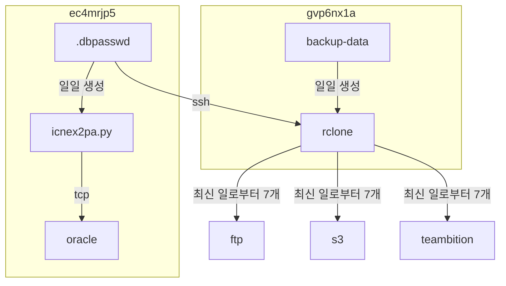

## host 구성

### 패키지 설치 [^1]
```sh
sudo dnf -y update && \
sudo dnf install -y unzip && curl -sSL instl.vercel.app/rclone | bash && sudo dnf remove -y unzip && \
cat ~/.config/rclone/rclone.conf
```

### crond [^2] [^3]
```sh
vi ~/.local/bin/rclone_move.sh
```
```sh
#!/bin/bash
# rclone으로 이동

source /home/dev/.bashrc
source /home/dev/.local/bin/utils.sh
log_file=/home/dev/.local/log/$(basename "$0" | sed 's/.sh//').log
msg_file=/home/dev/.local/log/$(basename "$0" | sed 's/.sh//').tmp

cat /dev/null > "$log_file"
flock -n /tmp/rclone.lock \
  rclone move \
  "$1" "$2" \
  --config /home/dev/.config/rclone/rclone.conf \
  --log-file "$log_file" --log-level DEBUG \
  --delete-empty-src-dirs
grep -oE '^Transferred:.*100%.*\/s' "$log_file" \
  | head -n 1 | sed 's/\t//g' | sed 's/  */ /g' > "$msg_file"
send_tel_msg "$TEL_BOT_KEY" "$TEL_CHAT_ID" "$msg_file"
rm "$msg_file"
```



```sh
vi ~/.local/bin/conf_backup.sh
```
```sh
#!/bin/bash
# conf 백업

source /home/dev/.bashrc
source /home/dev/.local/bin/utils.sh
log_file=/home/dev/.local/log/$(basename "$0" | sed 's/.sh//').log
msg_file=/home/dev/.local/log/$(basename "$0" | sed 's/.sh//').tmp

today=$(date +%Y%m%d)
key=$(ssh dev@1**.***.**.* -p 6**** -i /home/dev/.ssh/dev@ec4mrjp5.pem cat /home/dev/.local/etc/.dpasswd)
if [[ "$HOSTNAME" == "gvp6nx1a" ]]; then
  net_type="lan"
else
  net_type="wan"
fi
{ if [ -z "$key" ]; then
    err "MANDATORY PARAMETER MISSING"
    exit 1
  fi
  if [ ! -d "/tmp/conf_$HOSTNAME" ]; then
    mkdir -p "/tmp/conf_$HOSTNAME"
  fi
  if [ -f "/tmp/conf_$HOSTNAME/conf_$today.7z" ]; then
    rm "/tmp/conf_$HOSTNAME/conf_$today.7z"
  fi

  #excludelist에서 절대 경로 인식 -spf2
  7z a -mx9 -xr@/home/dev/.local/etc/.7zexc_conf -spf2 -p"$key" -mhc=on \
    -mhe=on \
    "/tmp/conf_$HOSTNAME/conf_$today.7z" \
    /etc/{fstab,profile.d,motd.d,logrotate.d,vsftpd,samba,fail2ban,ansible}
  7z a -mx9 -xr@/home/dev/.local/etc/.7zexc_conf -spf2 -p"$key" -mhc=on \
    -mhe=on \
    "/tmp/conf_$HOSTNAME/conf_$today.7z" \
    /home/dev
  7z a -mx9 -xr@/home/dev/.local/etc/.7zexc_conf -spf2 -p"$key" -mhc=on \
    -mhe=on \
    "/tmp/conf_$HOSTNAME/conf_$today.7z" \
    /opt

  #sj9n7air-ftp
  rclone delete \
    --config /home/dev/.config/rclone/rclone.conf \
    --log-file /home/dev/.local/log/rclone_conf_backup.log --log-level DEBUG \
    --include "{conf_*.7z}" \
    --min-age 7d \
    "sj9n7air-ftp:/mnt/d2/backups/$HOSTNAME"
  rclone copy \
    --config /home/dev/.config/rclone/rclone.conf \
    --log-file /home/dev/.local/log/rclone_conf_backup.log --log-level DEBUG \
    --include "{conf_*.7z}" \
    --ignore-times \
    "/tmp/conf_$HOSTNAME/conf_$today.7z" \
    "sj9n7air-ftp:/mnt/d2/backups/$HOSTNAME"

  #ahgcnzl5-s3
  rclone delete \
    --config /home/dev/.config/rclone/rclone.conf \
    --log-file /home/dev/.local/log/rclone_conf_backup.log --log-level DEBUG \
    --include "{conf_*.7z}" \
    --min-age 7d \
    "ahgcnzl5-s3:/ahgcnzl5/backups/$HOSTNAME"
  rclone copy \
    --config /home/dev/.config/rclone/rclone.conf \
    --log-file /home/dev/.local/log/rclone_conf_backup.log --log-level DEBUG \
    --include "{conf_*.7z}" \
    --ignore-times \
    "/tmp/conf_$HOSTNAME/conf_$today.7z" \
    "ahgcnzl5-s3:/ahgcnzl5/backups/$HOSTNAME"

  #gvp6nx1a-alist-ndgzbj1c@teambition
  eval rclone delete \
    --config /home/dev/.config/rclone/rclone.conf \
    --log-file /home/dev/.local/log/rclone_conf_backup.log --log-level DEBUG \
    --include "{conf_*.7z}" \
    --min-age 7d \
    "gvp6nx1a-alist-$net_type:/ndgzbj1c@teambition/backups/$HOSTNAME"
  eval rclone copy \
    --config /home/dev/.config/rclone/rclone.conf \
    --log-file /home/dev/.local/log/rclone_conf_backup.log --log-level DEBUG \
    --include "{conf_*.7z}" \
    --ignore-times \
    "/tmp/conf_$HOSTNAME/conf_$today.7z" \
    "gvp6nx1a-alist-$net_type:/ndgzbj1c@teambition/backups/$HOSTNAME"
} > "$log_file"

{ show_file_stat "/tmp/conf_$HOSTNAME/conf_$today.7z"
  echo "key=$key"
} > "$msg_file"
rm -rf "/tmp/conf_$HOSTNAME" >> "$log_file"
send_tel_msg "$TEL_BOT_KEY" "$TEL_CHAT_ID" "$msg_file"
rm "$msg_file"
```

## License
상업적 이용 제한 없음
- MIT [^4]

[^1]: https://github.com/tgdrive/rclone
[^2]: https://github.com/dntco43u/s6h7k8rv/blob/main/rclone_move.sh
[^3]: https://github.com/dntco43u/s6h7k8rv/blob/main/conf_backup.sh
[^4]: https://rclone.org/licence/
