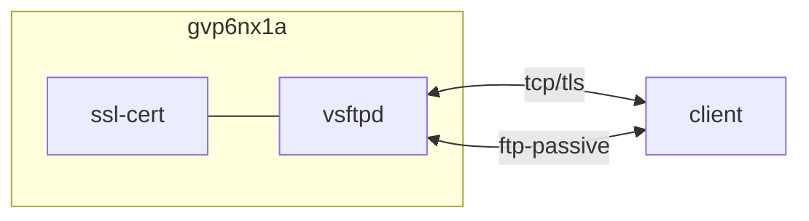

## host 구성

### 포트 개방
```sh
sudo firewall-cmd --permanent --add-forward-port=port=6****:proto=tcp:toport=21 && \
sudo firewall-cmd --permanent --add-port=6****-6****/tcp && \
sudo firewall-cmd --reload && \
sudo firewall-cmd --list-all
```

### selinux
{}
Permissive mode인 경우에도 필수적으로 구성
{}
```sh
sudo setsebool -P ftpd_use_passive_mode on && \
sudo setsebool -P ftpd_full_access on
```

### 설치
```sh
sudo dnf update -y && sudo dnf install -y vsftpd && \
sudo systemctl enable vsftpd && \
sudo systemctl start vsftpd && \
sudo systemctl status vsftpd
```
```sh
sudo cp /etc/vsftpd/vsftpd.conf /etc/vsftpd/vsftpd.conf.bak && \
sudo cp /etc/vsftpd/ftpusers /etc/vsftpd/ftpusers.bak
```
root 접속 허용 (optional)
```sh
sudo sed -i 's/root/#root/g' /etc/vsftpd/ftpusers
```

### vsftpd.conf
```sh
sudo vi /etc/vsftpd/vsftpd.conf
```
```ini
# rhel
pam_service_name=vsftpd

# security
anonymous_enable=NO
write_enable=YES
local_enable=YES
local_root=/
local_umask=022
userlist_enable=NO
userlist_deny=NO
chroot_list_enable=NO
chroot_local_user=YES
secure_chroot_dir=/var/empty
allow_writeable_chroot=YES

# passive
listen=YES
listen_ipv6=NO
connect_from_port_20=NO
pasv_enable=YES
pasv_address=1**.***.***.***
pasv_min_port=6****
pasv_max_port=6****

# ssl
rsa_cert_file=/opt/.acme/gvp6nx1a.duckdns.org_ecc/fullchain.cer
rsa_private_key_file=/opt/.acme/gvp6nx1a.duckdns.org_ecc/gvp6nx1a.duckdns.org.key
ssl_enable=YES
allow_anon_ssl=NO
require_ssl_reuse=YES
ssl_ciphers=HIGH
ssl_sslv2=NO
ssl_sslv3=NO
ssl_tlsv1=NO
ssl_tlsv1_1=NO
ssl_tlsv1_2=YES
ssl_tlsv1_3=YES

# log
dirmessage_enable=YES
xferlog_enable=YES
xferlog_std_format=YES
log_ftp_protocol=YES
dual_log_enable=YES

# etc
seccomp_sandbox=NO
force_dot_files=YES
idle_session_timeout=0
```

### logrotate
```sh
sudo vi /etc/logrotate.d/vsftpd
```
```propertiies
/var/log/vsftpd.log
/var/log/xferlog {
  daily
  rotate 7
  missingok
  notifempty
  dateext
  dateyesterday
  dateformat -%Y%m%d
  sharedscripts
  postrotate
    /usr/bin/systemctl restart vsftpd.service >/dev/null 2>&1 || true
  endscript
}
```

### crond [^1] [^3]
```sh
vi ~/.local/bin/reload_services.sh
```
```sh
#!/bin/bash
# 변경된 구성을 반영하기 위한 서비스 재시작

source /home/dev/.bashrc
source /home/dev/.local/bin/utils.sh
log_file=/home/dev/.local/log/$(basename "$0" | sed 's/.sh//').log
msg_file=/home/dev/.local/log/$(basename "$0" | sed 's/.sh//').tmp

{ if [ -d /opt/nginx ]; then
    docker exec -i nginx nginx -s reload
    echo "nginx: $(docker inspect --format '{{json .State.Status}}' nginx \
      | sed 's/"//g')"
  fi

  if [ -d /opt/jenkins/ ]; then
    cd /opt/jenkins || exit
    docker compose rm -f -s && docker compose pull && docker compose up -d
    echo "jenkins: $(docker inspect --format '{{json .State.Status}}' jenkins \
      | sed 's/"//g')"
  fi

  #FIXME: promtail 15:00 종료 원인 파악될 때까지
  if [ -d /opt/promtail ]; then
    cd /opt/promtail || exit
    docker compose rm -f -s && docker compose pull && docker compose up -d
    echo "promtail: $(docker inspect --format '{{json .State.Status}}' promtail \
      | sed 's/"//g')"
  fi

  if [ -d /etc/vsftpd ]; then
    systemctl restart vsftpd.service
    echo "vsftpd.service: $(systemctl is-active vsftpd.service)"
  fi

  systemctl list-units --type service | grep failed | awk '{print $2 ": failed"}'
} > "$log_file"
cp "$log_file" "$msg_file"
send_tel_msg "$TEL_BOT_KEY" "$TEL_CHAT_ID" "$msg_file"
rm "$msg_file"
```
```sh
vi ~/.local/bin/vsftpd_ddns.sh
```
```sh
#!/bin/bash
# vsftpd 동적 ip 구성

source /home/dev/.bashrc
source /home/dev/.local/bin/utils.sh
log_file=/home/dev/.local/log/$(basename "$0" | sed 's/.sh//').log
msg_file=/home/dev/.local/log/$(basename "$0" | sed 's/.sh//').tmp

ftp_ip=$(grep -E "(^pasv_address=)(.*)" /etc/vsftpd/vsftpd.conf \
  | sed -E "s/(^pasv_address=)(.*)/\2/g")
real_ip=$(dig +short txt ch whoami.cloudflare @1.1.1.1 | sed 's/"//g')

if [ "$ftp_ip" != "$real_ip" ]; then
  sed -Ei "s/(^pasv_address=)(.*)/\1$real_ip/g" /etc/vsftpd/vsftpd.conf
  systemctl restart vsftpd.service
  echo "vsftpd: pasv_address=$real_ip" > "$log_file"
  cp "$log_file" "$msg_file"
  send_tel_msg "$TEL_BOT_KEY" "$TEL_CHAT_ID" "$msg_file"
  rm "$msg_file"
fi
```

## 테스트
rclone 호환 테스트
```sh
echo "testfile" | tee ~/testfile && \
REMOTE_FTP=gvp6nx1a-ftp: && \
rclone copy "$REMOTE_FTP"/home/dev/testfile /tmp -vv -P && \
rclone delete "$REMOTE_FTP"/home/dev/testfile -vv -P && \
rclone move /tmp/testfile "$REMOTE_FTP"/home/dev -vv -P && \
unset REMOTE_FTP && \
rm ~/testfile
```

## License
상업적 이용 제한 없음
- GNU GPL [^4]

## Troubleshooting
{}
> 원인을 알 수 없는 오류들.

구성 중에 selinux 로그는 항상 확인할 것.
```sh
sudo journalctl -t audit -f
```
{}
{}
> rclone: local error: tls: protocol version not supported

ssl_tlsv1/v1_1=NO 구성 추가. vsftp TLS 1.3은 rclone 호환 불가. rclone 문서의 TLS 1.3 비활성화 참고  [^2]
{}
{}
> rclone: Fatal error: 500 OOPS: priv_sock_get_cmd

seccomp_sandbox=NO 구성 추가. 추가 보안 계층 비활성화.
{}

## References
- https://rclone.org/ftp/
- https://forum.rclone.org/t/is-encryption-ftp-explicit-over-tls-supported/30770/2
- https://access.redhat.com/solutions/3436
- https://wiki.gentoo.org/wiki/Vsftpd

[^1]: https://github.com/dntco43u/s6h7k8rv/blob/main/reload_services.sh
[^2]: --ftp-disable-tls13 Disable TLS 1.3 workaround for FTP servers with buggy TLS
[^3]: https://github.com/dntco43u/s6h7k8rv/blob/main/vsftpd_ddns.sh
[^4]: https://en.wikipedia.org/wiki/Vsftpd
