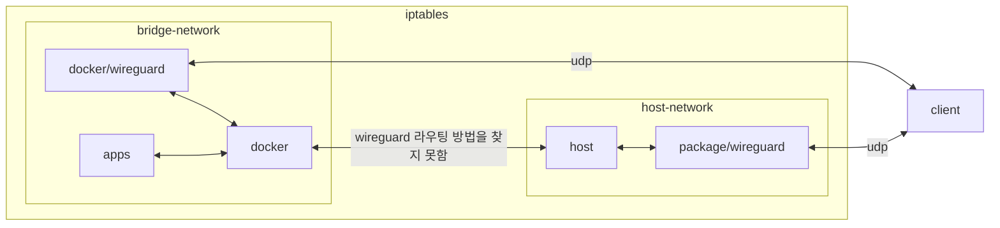

## host 구성

### 포트 개방
```sh
sudo firewall-cmd --permanent --add-port=6****/udp && \
sudo firewall-cmd --reload && \
sudo firewall-cmd --list-all
```

## container 구성

### docker-compose.yml
```sh
vi /opt/wireguard/docker-compose.yml
```
```yml
services:
  wireguard:
    image: linuxserver/wireguard:1.0.20210914
    container_name: wireguard
    networks:
      - dev
    ports:
      - 6****:6****/udp
    user: 0:0
    environment:
      - PUID=1000
      - PGID=1000
      - TZ=Asia/Seoul
      - PEERS=1
      - PEERDNS=auto
      - LOG_CONFS=false
    volumes:
      - /usr/src:/usr/src:ro
      - /lib/modules:/lib/modules:ro
      - /opt/wireguard/config/wg_confs/wg0.conf:/config/wg_confs/wg0.conf:ro
      - /opt/wireguard/config/coredns/Corefile:/config/coredns/Corefile:ro
    cap_add:
      - NET_ADMIN
      - SYS_MODULE
    sysctls:
      - net.ipv4.conf.all.src_valid_mark=1
    restart: unless-stopped
networks:
  dev:
    external: true
```

### key 생성
```sh
docker exec -it wireguard /bin/sh && \
umask 077 && \
wg genkey | tee /etc/wireguard/server.key | wg pubkey > /etc/wireguard/server.pub && \
wg genkey | tee /etc/wireguard/client.key | wg pubkey > /etc/wireguard/client.pub && \
wg genpsk > /etc/wireguard/client.psk && \
cat /etc/wireguard/server.key && \
cat /etc/wireguard/server.pub && \
cat /etc/wireguard/client.key && \
cat /etc/wireguard/client.pub && \
cat /etc/wireguard/client.psk
```

### wg0.conf
```sh
vi /opt/wireguard/config/wg_confs/wg0.conf
```
```ini
[Interface]
Address = 10.10.0.4/32
ListenPort = 6****
PrivateKey = +******************************************=
PostUp = iptables -A FORWARD -i %i -j ACCEPT; iptables -A FORWARD -o %i -j ACCEPT; iptables -t nat -A POSTROUTING -o eth+ -j MASQUERADE
PostDown = iptables -D FORWARD -i %i -j ACCEPT; iptables -D FORWARD -o %i -j ACCEPT; iptables -t nat -D POSTROUTING -o eth+ -j MASQUERADE

[Peer]
PublicKey = t******************************************=
PresharedKey = h******************************************=
AllowedIPs = 10.10.0.0/24
PersistentKeepalive = 25
```

### Corefile
coredns healthcheck 비활성화
```sh
tee /opt/wireguard/config/coredns/Corefile <<EOF
. {
    forward . /etc/resolv.conf
}
EOF
```

## 테스트
dns 누출 확인
- https://www.cloudflare.com/ssl/encrypted-sni/
- https://dnsleaktest.com/
- https://ipleak.net/

## License
상업적 이용 제한 없음
- GNU GPL v2 [^1]

## Troubleshooting
{}
> 기본 패키지의 wireguard가 docker bridge network에 접근할 수 있는 라우팅 방법을 찾지 못함

docker wireguard를 동일 bridge network에 설치. 이 구성은 host와 bridge 모두 접근 가눙
{}

{}
> 작동하지 않았던 구성

- https://www.linux.org/threads/wireguard-iptables-rules.45473<br>
- https://www.cyberciti.biz/faq/how-to-set-up-wireguard-firewall-rules-in-linux
{}

{}
> iptables v1.8.9 (legacy): can't initialize iptables table 'filter': Table does not exist (do you need to insmod?)

wireguard 호환 커널 모듈의 적재 필요
```sh
sudo modprobe iptable_raw && \
sudo reboot
```
```sh
echo "iptable_raw" | sudo tee /etc/modules-load.d/iptable_raw.conf && \
sudo lsmod | grep "ip_table"
```
{}

## References
- https://github.com/BrodyBuster/docker-wireguard-vpn

[^1]: https://www.wireguard.com/#license
